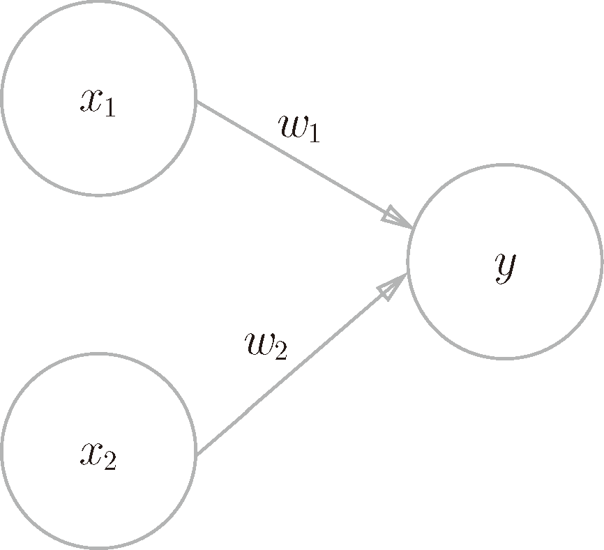
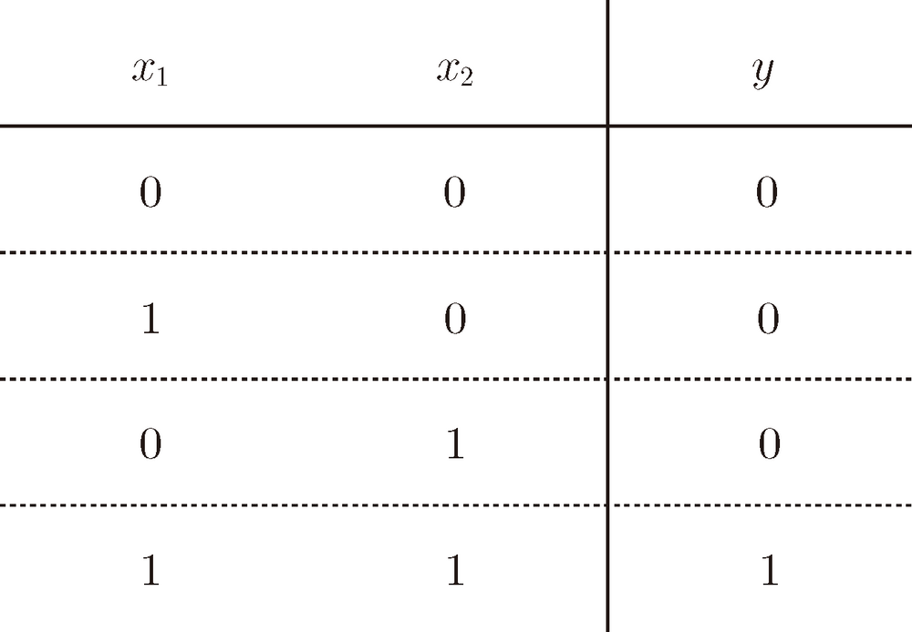
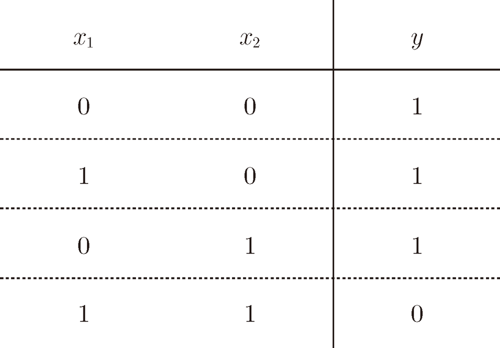
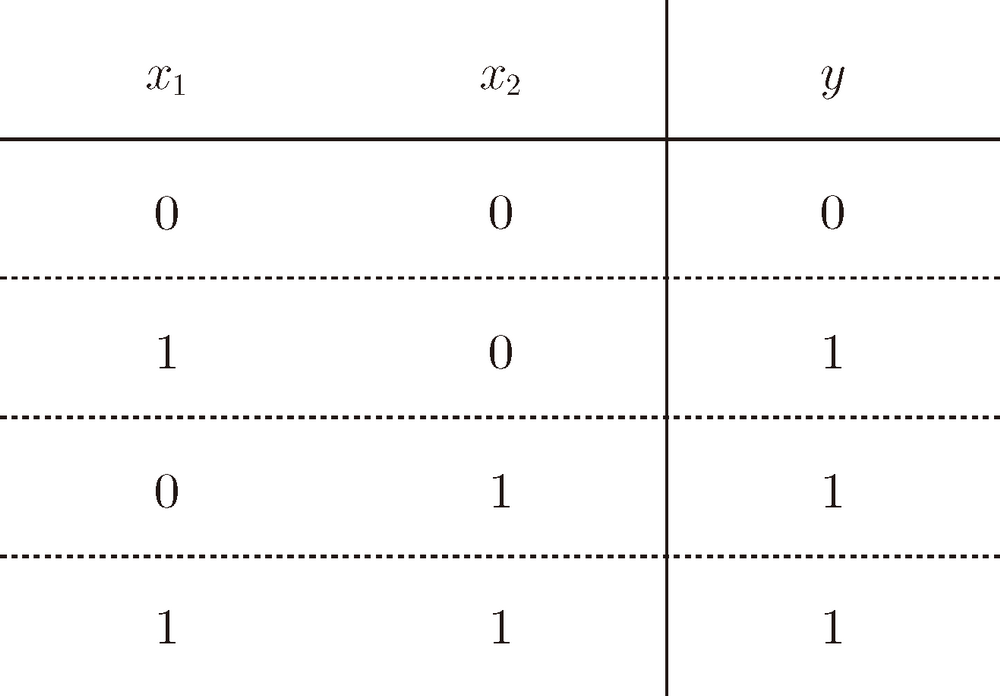
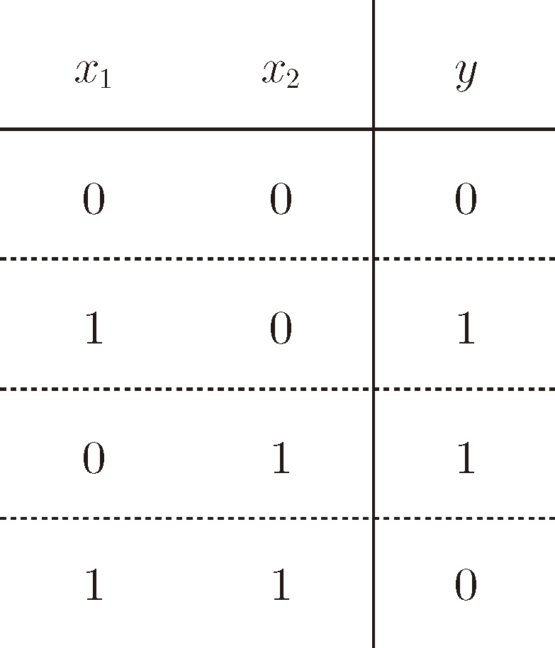
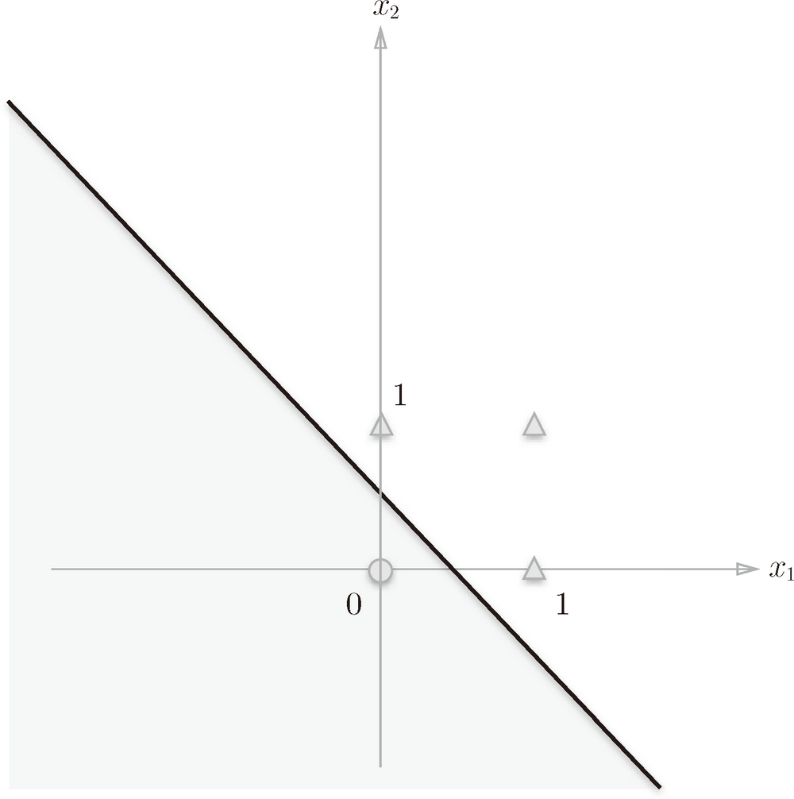
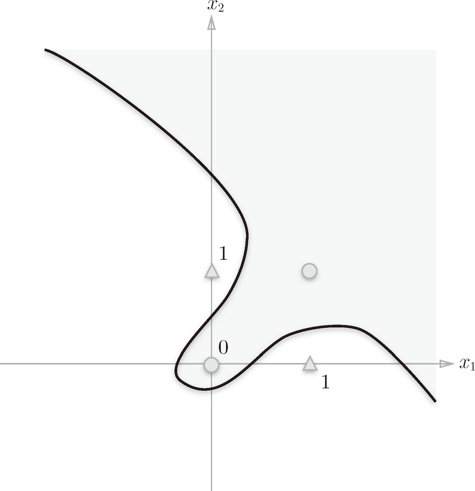
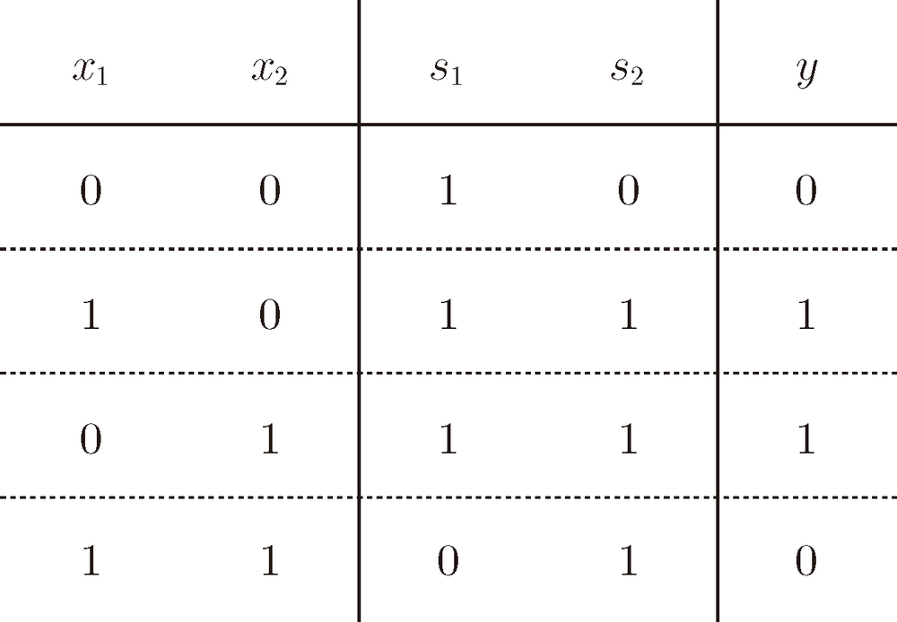
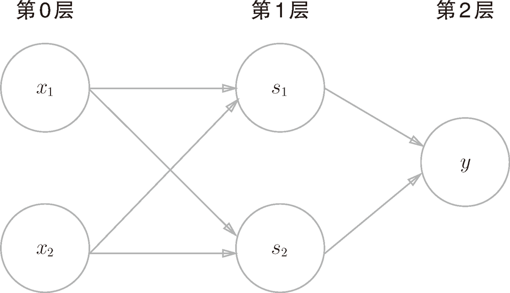

第2章 感知机

### 2.1　感知机是什么

感知机接收多个输入信号，输出一个信号。这里所说的“信号”可以想象成电流或河流那样具备“流动性”的东西。像电流流过导线，向前方输送电子一样，感知机的信号也会形成流，向前方输送信息。但是，和实际的电流不同的是，感知机的信号只有“流 / 不流”（1/0）两种取值。在中，0 对应“不传递信号”，1 对应“传递信号”。

图 2-1 是一个接收两个输入信号的感知机的例子。*x*1、*x*2 是输入信号，*y* 是输出信号，*w*1、*w*2 是权重（*w* 是 weight 的首字母）。图中的○称为“神经元”或者“节点”。输入信号被送往神经元时，会被分别乘以固定的权重（*w*1*x*1、*w*2*x*2）。神经元会计算传送过来的信号的总和，只有当这个总和超过了某个界限值时，才会输出 1。这也称为“神经元被激活”。这里将这个界限值称为**阈值**，用符号 *θ* 表示。



**图 2-1　有两个输入的感知机**

感知机的运行原理只有这些！把上述内容用数学式来表示，就是式（2.1）。


感知机的多个输入信号都有各自固有的权重，这些权重发挥着控制各个信号的重要性的作用。也就是说，权重越大，对应该权重的信号的重要性就越高。

### 2.2　简单逻辑电路

#### 2.2.1　与门

现在让我们考虑用感知机来解决简单的问题。这里首先以逻辑电路为题材来思考一下与门（AND gate）。与门是有两个输入和一个输出的门电路。图 2-2 这种输入信号和输出信号的对应表称为“真值表”。如图 2-2 所示，与门仅在两个输入均为 1 时输出 1，其他时候则输出 0。



**图 2-2　与门的真值表**

下面考虑用感知机来表示这个与门。需要做的就是确定能满足图 2-2 的真值表的 *w*1、*w*2、*θ* 的值。那么，设定什么样的值才能制作出满足图 2-2 的条件的感知机呢？

实际上，满足图 2-2 的条件的参数的选择方法有无数多个。比如，当 (*w*1,*w*2,*θ*)=(0.5,0.5,0.7)时，可以满足图 2-2 的条件。此外，当(*w*1,*w*2,*θ*)为 (0.5, 0.5, 0.8) 或者 (1.0, 1.0, 1.0) 时，同样也满足与门的条件。设定这样的参数后，仅当 *x*1 和 *x*2 同时为 1 时，信号的加权总和才会超过给定的阈值 *θ*。

#### 2.2.2　与非门和或门

接着，我们再来考虑一下与非门（NAND gate）。NAND 是 Not AND 的意思，与非门就是颠倒了与门的输出。用真值表表示的话，如图 2-3 所示，仅当 *x*1 和 *x*2 同时为 1 时输出 0，其他时候则输出 1。那么与非门的参数又可以是什么样的组合呢？



**图 2-3　与非门的真值表**

要表示与非门，可以用(*w*1,*w*2,*θ*)=(-0.5,-0.5,-0.7)这样的组合（其他的组合也是无限存在的）。实际上，只要把实现与门的参数值的符号取反，就可以实现与非门。

接下来看一下图 2-4 所示的或门。或门是“只要有一个输入信号是 1，输出就为 1”的逻辑电路。那么我们来思考一下，应该为这个或门设定什么样的参数呢？



**图 2-4　或门的真值表**

> 这里决定感知机参数的并不是计算机，而是我们人。我们看着真值表这种“训练数据”，人工考虑（想到）了参数的值。而机器学习的课题就是将这个决定参数值的工作交由计算机自动进行。**学习**是确定合适的参数的过程，而人要做的是思考感知机的构造（模型），并把训练数据交给计算机。

如上所示，我们已经知道使用感知机可以表示与门、与非门、或门的逻辑电路。这里重要的一点是：与门、与非门、或门的感知机构造是一样的。实际上，3 个门电路只有参数的值（权重和阈值）不同。也就是说，相同构造的感知机，只需通过适当地调整参数的值，就可以像“变色龙演员”表演不同的角色一样，变身为与门、与非门、或门。

### 2.3　感知机的实现

#### 2.3.1　简单的实现

现在，我们用 Python 来实现刚才的逻辑电路。这里，先定义一个接收参数 `x1` 和 `x2` 的 `AND` 函数。

```
def AND(x1, x2):
    w1, w2, theta = 0.5, 0.5, 0.7
    tmp = x1*w1 + x2*w2
    if tmp <= theta:
        return 0
    elif tmp > theta:
        return 1
```

在函数内初始化参数 `w1`、`w2`、`theta`，当输入的加权总和超过阈值时返回 `1`，否则返回 `0`。我们来确认一下输出结果是否如图 2-2 所示。

```
AND(0, 0) # 输出0
AND(1, 0) # 输出0
AND(0, 1) # 输出0
AND(1, 1) # 输出1
```

果然和我们预想的输出一样！这样我们就实现了与门。按照同样的步骤，也可以实现与非门和或门，不过让我们来对它们的实现稍作修改。

#### 2.3.2　导入权重和偏置

刚才的与门的实现比较直接、容易理解，但是考虑到以后的事情，我们将其修改为另外一种实现形式。在此之前，首先把式（2.1）的 *θ* 换成 -*b*，于是就可以用式（2.2）来表示感知机的行为。


式（2.1）和式（2.2）虽然有一个符号不同，但表达的内容是完全相同的。此处，*b* 称为**偏置**，*w*1 和 *w*2 称为**权重**。如式（2.2）所示，感知机会计算输入信号和权重的乘积，然后加上偏置，如果这个值大于 0 则输出 1，否则输出 0。下面，我们使用 NumPy，按式（2.2）的方式实现感知机。在这个过程中，我们用 Python 的解释器逐一确认结果。

```
>>> import numpy as np
>>> x = np.array([0, 1])     # 输入
>>> w = np.array([0.5, 0.5]) # 权重
>>> b = -0.7                 # 偏置
>>> w*x
array([ 0. , 0.5])
>>> np.sum(w*x)
0.5
>>> np.sum(w*x) + b
-0.19999999999999996   # 大约为-0.2（由浮点小数造成的运算误差）
```

如上例所示，在 NumPy 数组的乘法运算中，当两个数组的元素个数相同时，各个元素分别相乘，因此 `w*x` 的结果就是它们的各个元素分别相乘（`[0, 1] * [0.5, 0.5] => [0, 0.5]`）。之后，`np.sum(w*x)` 再计算相乘后的各个元素的总和。最后再把偏置加到这个加权总和上，就完成了式（2.2）的计算。

#### 2.3.3　使用权重和偏置的实现

使用权重和偏置，可以像下面这样实现与门。

```
def AND(x1, x2):
    x = np.array([x1, x2])
    w = np.array([0.5, 0.5])
    b = -0.7
    tmp = np.sum(w*x) + b
    if tmp <= 0:
       return 0
    else:
       return 1
```

这里把 -*θ* 命名为偏置 *b*，但是请注意，偏置和权重 *w*1、*w*2 的作用是不一样的。具体地说，*w*1 和 *w*2是控制输入信号的重要性的参数，而偏置是调整神经元被激活的容易程度（输出信号为 1 的程度）的参数。比如，若 *b* 为 -0.1，则只要输入信号的加权总和超过 0.1，神经元就会被激活。但是如果 *b* 为 -20.0，则输入信号的加权总和必须超过 20.0，神经元才会被激活。像这样，偏置的值决定了神经元被激活的容易程度。另外，这里我们将 *w*1 和 *w*2 称为权重，将 *b* 称为偏置，但是根据上下文，有时也会将 *b*、*w*1、*w*2 这些参数统称为权重。

接着，我们继续实现与非门和或门。

```
def NAND(x1, x2):
    x = np.array([x1, x2])
    w = np.array([-0.5, -0.5]) # 仅权重和偏置与AND不同！
    b = 0.7
    tmp = np.sum(w*x) + b
    if tmp <= 0:
        return 0
    else:
        return 1

def OR(x1, x2):
    x = np.array([x1, x2])
    w = np.array([0.5, 0.5]) # 仅权重和偏置与AND不同！
    b = -0.2
    tmp = np.sum(w*x) + b
    if tmp <= 0:
        return 0
    else:
        return 1
```

我们在 2.2 节介绍过，与门、与非门、或门是具有相同构造的感知机，区别只在于权重参数的值。因此，在与非门和或门的实现中，仅设置权重和偏置的值这一点和与门的实现不同。

### 2.4　感知机的局限性

到这里我们已经知道，使用感知机可以实现与门、与非门、或门三种逻辑电路。现在我们来考虑一下异或门（XOR gate）。

#### 2.4.1　异或门

异或门也被称为**逻辑异或**电路。如图 2-5 所示，仅当 *x*1 或 *x*2 中的一方为 1 时，才会输出 1（“异或”是拒绝其他的意思）。那么，要用感知机实现这个异或门的话，应该设定什么样的权重参数呢？



**图 2-5　异或门的真值表**

实际上，用前面介绍的感知机是无法实现这个异或门的。为什么用感知机可以实现与门、或门，却无法实现异或门呢？下面我们尝试通过画图来思考其中的原因。

首先，我们试着将或门的动作形象化。或门的情况下，当权重参数(*b*,*w*1,*w*2)=(-0.5,1.0,1.0)时，可满足图 2-4 的真值表条件。此时，感知机可用下面的式（2.3）表示。


式（2.3）表示的感知机会生成由直线-0.5+*x*1+*x*2=0 分割开的两个空间。其中一个空间输出 1，另一个空间输出 0，如图 2-6 所示。



**图 2-6　感知机的可视化：灰色区域是感知机输出 0 的区域，这个区域与或门的性质一致**

或门在(*x*1,*x*2)=(0,0)时输出 0，在 (*x*1,*x*2) 为 (0, 1)、(1, 0)、(1, 1) 时输出 1。图 2-6 中，○ 表示 0，△ 表示 1。如果想制作或门，需要用直线将图 2-6 中的○和△分开。实际上，刚才的那条直线就将这 4 个点正确地分开了。

那么，换成异或门的话会如何呢？能否像或门那样，用一条直线作出分割图 2-7 中的○和△的空间呢？


**图 2-7　○ 和 △ 表示异或门的输出。可否通过一条直线作出分割○和△的空间呢？**

想要用一条直线将图 2-7 中的○和△分开，无论如何都做不到。事实上，用一条直线是无法将○和△分开的。

#### 2.4.2　线性和非线性

图 2-7 中的○和△无法用一条直线分开，但是如果将“直线”这个限制条件去掉，就可以实现了。比如，我们可以像图 2-8 那样，作出分开○和△的空间。



**图 2-8　使用曲线可以分开○和△**

感知机的局限性就在于它只能表示由一条直线分割的空间。图 2-8 这样弯曲的曲线无法用感知机表示。另外，由图 2-8 这样的曲线分割而成的空间称为**非线性**空间，由直线分割而成的空间称为**线性**空间。线性、非线性这两个术语在机器学习领域很常见，可以将其想象成图 2-6 和图 2-8 所示的直线和曲线。

### 2.5　多层感知机

感知机不能表示异或门让人深感遗憾，但也无需悲观。实际上，感知机的绝妙之处在于它可以“叠加层”（通过叠加层来表示异或门是本节的要点）。这里，我们暂且不考虑叠加层具体是指什么，先从其他视角来思考一下异或门的问题。

#### 2.5.1　已有门电路的组合

异或门的制作方法有很多，其中之一就是组合我们前面做好的与门、与非门、或门进行配置。这里，与门、与非门、或门用图 2-9 中的符号表示。另外，图 2-9 中与非门前端的○表示反转输出的意思。


**图 2-9　与门、与非门、或门的符号**

那么，请思考一下，要实现异或门的话，需要如何配置与门、与非门和或门呢？这里给大家一个提示，用与门、与非门、或门代替图 2-10 中的各个“？”，就可以实现异或门。


**图 2-10　将与门、与非门、或门代入到“？”中，就可以实现异或门！**

异或门可以通过图 2-11 所示的配置来实现。这里，*x*1 和 *x*2 表示输入信号，*y* 表示输出信号。*x*1 和 *x*2是与非门和或门的输入，而与非门和或门的输出则是与门的输入。


**图 2-11　通过组合与门、与非门、或门实现异或门**

现在，我们来确认一下图 2-11 的配置是否真正实现了异或门。这里，把 *s*1 作为与非门的输出，把 *s*2作为或门的输出，填入真值表中。结果如图 2-12 所示，观察 *x*1、*x*2 、*y*，可以发现确实符合异或门的输出。



**图 2-12　异或门的真值表**

#### 2.5.2　异或门的实现

下面我们试着用 Python 来实现图 2-11 所示的异或门。使用之前定义的 AND 函数、NAND 函数、OR 函数，可以像下面这样（轻松地）实现。

```
def XOR(x1, x2):
    s1 = NAND(x1, x2)
    s2 = OR(x1, x2)
    y = AND(s1, s2)
    return y
```

这个 `XOR` 函数会输出预期的结果。

```
XOR(0, 0) # 输出0
XOR(1, 0) # 输出1
XOR(0, 1) # 输出1
XOR(1, 1) # 输出0
```

这样，异或门的实现就完成了。下面我们试着用感知机的表示方法（明确地显示神经元）来表示这个异或门，结果如图 2-13 所示。



**图 2-13　用感知机表示异或门**

如图 2-13 所示，异或门是一种多层结构的神经网络。这里，将最左边的一列称为第 0 层，中间的一列称为第 1 层，最右边的一列称为第 2 层。

图 2-13 所示的感知机与前面介绍的与门、或门的感知机（图 2-1）形状不同。实际上，与门、或门是单层感知机，而异或门是 2 层感知机。叠加了多层的感知机也称为**多层感知机**（multi-layered perceptron）。


