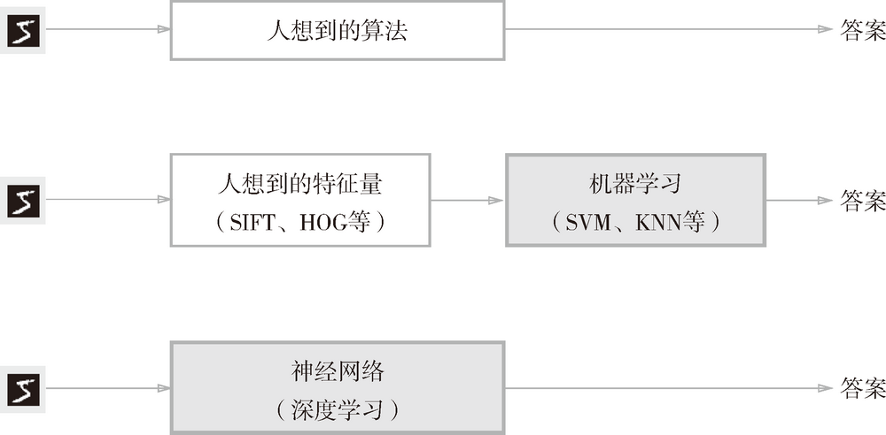
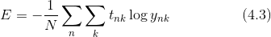
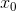
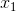
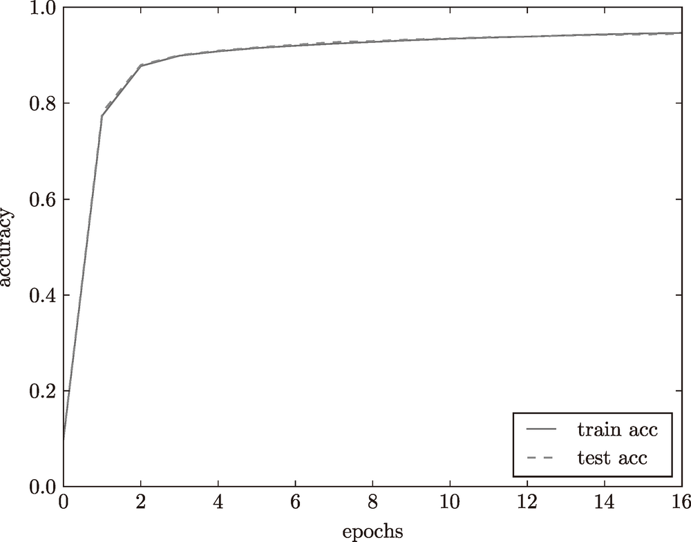

第4章 神经网络的学习

### 4.1　从数据中学习

神经网络的特征就是可以从数据中学习。所谓“从数据中学习”，是指可以由数据自动决定权重参数的值。这是非常了不起的事情！因为如果所有的参数都需要人工决定的话，工作量就太大了。在第 2 章介绍的感知机的例子中，我们对照着真值表，人工设定了参数的值，但是那时的参数只有 3 个。而在实际的神经网络中，参数的数量成千上万，在层数更深的深度学习中，参数的数量甚至可以上亿，想要人工决定这些参数的值是不可能的。

#### 4.1.1　数据驱动

数据是机器学习的命根子。从数据中寻找答案、从数据中发现模式、根据数据讲故事……这些机器学习所做的事情，如果没有数据的话，就无从谈起。因此，数据是机器学习的核心。

现在我们来思考一个具体的问题，比如如何实现数字“5”的识别。数字 5 是图 4-1 所示的手写图像，我们的目标是实现能区别是否是 5 的程序。这个问题看起来很简单，大家能想到什么样的算法呢？


**图 4-1　手写数字 5 的例子：写法因人而异，五花八门**

如果让我们自己来设计一个能将 5 正确分类的程序，就会意外地发现这是一个很难的问题。人可以简单地识别出 5，但却很难明确说出是基于何种规律而识别出了 5。

因此，与其绞尽脑汁，从零开始想出一个可以识别 5 的算法，不如考虑通过有效利用数据来解决这个问题。一种方案是，先从图像中提取**特征量**，再用机器学习技术学习这些特征量的模式。

到这里，我们介绍了两种针对机器学习任务的方法。将这两种方法用图来表示，如图 4-2 所示。图中还展示了神经网络（深度学习）的方法，可以看出该方法不存在人为介入。




**图 4-2　从人工设计规则转变为由机器从数据中学习：没有人为介入的方块用灰色表示**

神经网络的优点是对所有的问题都可以用同样的流程来解决。比如，不管要求解的问题是识别 5，还是识别狗，抑或是识别人脸，神经网络都是通过不断地学习所提供的数据，尝试发现待求解的问题的模式。也就是说，与待处理的问题无关，神经网络可以将数据直接作为原始数据，进行“端对端”的学习。

#### 4.1.2　训练数据和测试数据

机器学习中，一般将数据分为**训练数据**和**测试数据**两部分来进行学习和实验等。首先，使用训练数据进行学习，寻找最优的参数；然后，使用测试数据评价训练得到的模型的实际能力。为什么需要将数据分为训练数据和测试数据呢？因为我们追求的是模型的泛化能力。为了正确评价模型的**泛化能力**，就必须划分训练数据和测试数据。

泛化能力是指处理未被观察过的数据（不包含在训练数据中的数据）的能力。获得泛化能力是机器学习的最终目标。

因此，仅仅用一个数据集去学习和评价参数，是无法进行正确评价的。这样会导致可以顺利地处理某个数据集，但无法处理其他数据集的情况。顺便说一下，只对某个数据集过度拟合的状态称为**过拟合**（over fitting）。避免过拟合也是机器学习的一个重要课题。

### 4.2　损失函数

如果有人问你现在有多幸福，你会如何回答呢？一般的人可能会给出诸如“还可以吧”或者“不是那么幸福”等笼统的回答。如果有人回答“我现在的幸福指数是 10.23”的话，可能会把人吓一跳吧。因为他用一个数值指标来评判自己的幸福程度。

这里的幸福指数只是打个比方，实际上神经网络的学习也在做同样的事情。神经网络的学习通过某个指标表示现在的状态。然后，以这个指标为基准，寻找最优权重参数。和刚刚那位以幸福指数为指引寻找“最优人生”的人一样，神经网络以某个指标为线索寻找最优权重参数。神经网络的学习中所用的指标称为**损失函数**（loss function）。这个损失函数可以使用任意函数，但一般用均方误差和交叉熵误差等。

#### 4.2.1　均方误差

可以用作损失函数的函数有很多，其中最有名的是**均方误差**（mean squared error）。均方误差如下式所示。


这里，*yk* 是表示神经网络的输出，*tk* 表示监督数据，*k* 表示数据的维数。比如，在 3.6 节手写数字识别的例子中，*yk*、*tk* 是由如下 10 个元素构成的数据。

```
>>> y = [0.1, 0.05, 0.6, 0.0, 0.05, 0.1, 0.0, 0.1, 0.0, 0.0]
>>> t = [0, 0, 1, 0, 0, 0, 0, 0, 0, 0]
```

数组元素的索引从第一个开始依次对应数字“0”“1”“2”……这里，神经网络的输出 `y` 是 softmax 函数的输出。由于 softmax 函数的输出可以理解为概率，因此上例表示“0”的概率是 0.1，“1”的概率是 0.05，“2”的概率是 0.6 等。`t` 是监督数据，将正确解标签设为 1，其他均设为 0。这里，标签“2”为 1，表示正确解是“2”。将正确解标签表示为 1，其他标签表示为 0 的表示方法称为 **one-hot 表示**。

如式（4.1）所示，均方误差会计算神经网络的输出和正确解监督数据的各个元素之差的平方，再求总和。现在，我们用 Python 来实现这个均方误差，实现方式如下所示。

```
def mean_squared_error(y, t):
    return 0.5 * np.sum((y-t)**2)
```

这里，参数 `y` 和 `t` 是 NumPy 数组。代码实现完全遵照式（4.1），因此不再具体说明。现在，我们使用这个函数，来实际地计算一下。

```
>>> # 设“2”为正确解
>>> t = [0, 0, 1, 0, 0, 0, 0, 0, 0, 0]
>>>
>>> # 例1：“2”的概率最高的情况（0.6）
>>> y = [0.1, 0.05, 0.6, 0.0, 0.05, 0.1, 0.0, 0.1, 0.0, 0.0]
>>> mean_squared_error(np.array(y), np.array(t))
0.097500000000000031
>>>
>>> # 例2：“7”的概率最高的情况（0.6）
>>> y = [0.1, 0.05, 0.1, 0.0, 0.05, 0.1, 0.0, 0.6, 0.0, 0.0]
>>> mean_squared_error(np.array(y), np.array(t))
0.59750000000000003
```

这里举了两个例子。第一个例子中，正确解是“2”，神经网络的输出的最大值是“2”；第二个例子中，正确解是“2”，神经网络的输出的最大值是“7”。如实验结果所示，我们发现第一个例子的损失函数的值更小，和监督数据之间的误差较小。也就是说，均方误差显示第一个例子的输出结果与监督数据更加吻合。

#### 4.2.2　交叉熵误差

除了均方误差之外，**交叉熵误差**（cross entropy error）也经常被用作损失函数。交叉熵误差如下式所示。


这里，log 表示以 e为底数的自然对数(loge)。*yk* 是神经网络的输出，*tk* 是正确解标签。并且，*tk* 中只有正确解标签的索引为 1，其他均为 0（one-hot 表示）。因此，式（4.2）实际上只计算对应正确解标签的输出的自然对数。比如，假设正确解标签的索引是“2”，与之对应的神经网络的输出是 0.6，则交叉熵误差是 -log 0.6 = 0.51；若“2”对应的输出是 0.1，则交叉熵误差为 -log 0.1 = 2.30。也就是说，交叉熵误差的值是由正确解标签所对应的输出结果决定的。

自然对数的图像如图 4-3 所示。


**图 4-3　自然对数 y = log x 的图像**

如图 4-3 所示，*x* 等于 1 时，*y* 为 0；随着 *x* 向 0 靠近，*y* 逐渐变小。因此，正确解标签对应的输出越大，式（4.2）的值越接近 0；当输出为 1 时，交叉熵误差为 0。此外，如果正确解标签对应的输出较小，则式（4.2）的值较大。

下面，我们来用代码实现交叉熵误差。

```
def cross_entropy_error(y, t):
    delta = 1e-7
    return -np.sum(t * np.log(y + delta))
```

这里，参数 `y` 和 `t` 是 NumPy 数组。函数内部在计算 `np.log` 时，加上了一个微小值 `delta`。这是因为，当出现 `np.log(0)` 时，`np.log(0)` 会变为负无限大的 `-inf`，这样一来就会导致后续计算无法进行。作为保护性对策，添加一个微小值可以防止负无限大的发生。下面，我们使用 `cross_entropy_error(y, t)` 进行一些简单的计算。

```
>>> t = [0, 0, 1, 0, 0, 0, 0, 0, 0, 0]
>>> y = [0.1, 0.05, 0.6, 0.0, 0.05, 0.1, 0.0, 0.1, 0.0, 0.0]
>>> cross_entropy_error(np.array(y), np.array(t))
0.51082545709933802
>>>
>>> y = [0.1, 0.05, 0.1, 0.0, 0.05, 0.1, 0.0, 0.6, 0.0, 0.0]
>>> cross_entropy_error(np.array(y), np.array(t))
2.3025840929945458
```

第一个例子中，正确解标签对应的输出为 0.6，此时的交叉熵误差大约为 0.51。第二个例子中，正确解标签对应的输出为 0.1 的低值，此时的交叉熵误差大约为 2.3。由此可以看出，这些结果与我们前面讨论的内容是一致的。

#### 4.2.3　mini-batch 学习

机器学习使用训练数据进行学习。使用训练数据进行学习，严格来说，就是针对训练数据计算损失函数的值，找出使该值尽可能小的参数。因此，计算损失函数时必须将所有的训练数据作为对象。也就是说，如果训练数据有 100 个的话，我们就要把这 100 个损失函数的总和作为学习的指标。

前面介绍的损失函数的例子中考虑的都是针对单个数据的损失函数。如果要求所有训练数据的损失函数的总和，以交叉熵误差为例，可以写成下面的式（4.3）。



这里，假设数据有 *N* 个，*tnk* 表示第 *n* 个数据的第 *k* 个元素的值（*ynk* 是神经网络的输出，*tnk* 是监督数据）。式子虽然看起来有一些复杂，其实只是把求单个数据的损失函数的式（4.2）扩大到了 *N* 份数据，不过最后还要除以 *N* 进行正规化。通过除以 *N*，可以求单个数据的“平均损失函数”。通过这样的平均化，可以获得和训练数据的数量无关的统一指标。比如，即便训练数据有 1000 个或 10000 个，也可以求得单个数据的平均损失函数。

另外，MNIST 数据集的训练数据有 60000 个，如果以全部数据为对象求损失函数的和，则计算过程需要花费较长的时间。再者，如果遇到大数据，数据量会有几百万、几千万之多，这种情况下以全部数据为对象计算损失函数是不现实的。因此，我们从全部数据中选出一部分，作为全部数据的“近似”。神经网络的学习也是从训练数据中选出一批数据（称为 mini-batch, 小批量），然后对每个 mini-batch 进行学习。比如，从 60000 个训练数据中随机选择 100 笔，再用这 100 笔数据进行学习。这种学习方式称为 **mini-batch 学习**。

下面我们来编写从训练数据中随机选择指定个数的数据的代码，以进行 mini-batch 学习。在这之前，先来看一下用于读入 MNIST 数据集的代码。

```
import sys, os
sys.path.append(os.pardir)
import numpy as np
from dataset.mnist import load_mnist

(x_train, t_train), (x_test, t_test) = \
    load_mnist(normalize=True, one_hot_label=True)

print(x_train.shape) # (60000, 784)
print(t_train.shape) # (60000, 10)
```

第 3 章介绍过，`load_mnist` 函数是用于读入 MNIST 数据集的函数。这个函数在提供的脚本 `dataset/mnist.py` 中，它会读入训练数据和测试数据。读入数据时，通过设定参数 `one_hot_label=True`，可以得到 one-hot 表示（即仅正确解标签为 1，其余为 0 的数据结构）。

读入上面的 MNIST 数据后，训练数据有 60000 个，输入数据是 784 维（28 × 28）的图像数据，监督数据是 10 维的数据。因此，上面的 `x_train`、`t_train` 的形状分别是 `(60000, 784)` 和 `(60000, 10)`。

那么，如何从这个训练数据中随机抽取 10 笔数据呢？我们可以使用 NumPy 的 `np.random.choice()`，写成如下形式。

```
train_size = x_train.shape[0]
batch_size = 10
batch_mask = np.random.choice(train_size, batch_size)
x_batch = x_train[batch_mask]
t_batch = t_train[batch_mask]
```

使用 `np.random.choice()` 可以从指定的数字中随机选择想要的数字。比如，`np.random.choice(60000, 10)` 会从 0 到 59999 之间随机选择 10 个数字。如下面的实际代码所示，我们可以得到一个包含被选数据的索引的数组。

```
>>> np.random.choice(60000, 10)
array([ 8013, 14666, 58210, 23832, 52091, 10153, 8107, 19410, 27260,
21411])
```

之后，我们只需指定这些随机选出的索引，取出 mini-batch，然后使用这个 mini-batch 计算损失函数即可。

#### 4.2.4　mini-batch 版交叉熵误差的实现

如何实现对应 mini-batch 的交叉熵误差呢？只要改良一下之前实现的对应单个数据的交叉熵误差就可以了。这里，我们来实现一个可以同时处理单个数据和批量数据（数据作为 batch 集中输入）两种情况的函数。

```
def cross_entropy_error(y, t):
    if y.ndim == 1:
        t = t.reshape(1, t.size)
        y = y.reshape(1, y.size)

    batch_size = y.shape[0]
    return -np.sum(t * np.log(y + 1e-7)) / batch_size
```

这里，`y` 是神经网络的输出，`t` 是监督数据。`y` 的维度为 1 时，即求单个数据的交叉熵误差时，需要改变数据的形状。并且，当输入为 mini-batch 时，要用 batch 的个数进行正规化，计算单个数据的平均交叉熵误差。

此外，当监督数据是标签形式（非 one-hot 表示，而是像“2”“7”这样的标签）时，交叉熵误差可通过如下代码实现。

```
def cross_entropy_error(y, t):
    if y.ndim == 1:
        t = t.reshape(1, t.size)
        y = y.reshape(1, y.size)

    batch_size = y.shape[0]
    return -np.sum(np.log(y[np.arange(batch_size), t] + 1e-7)) / batch_size
```

实现的要点是，由于 one-hot 表示中 `t` 为 0 的元素的交叉熵误差也为 0，因此针对这些元素的计算可以忽略。换言之，如果可以获得神经网络在正确解标签处的输出，就可以计算交叉熵误差。因此，`t` 为 `one-hot` 表示时通过 `t * np.log(y)` 计算的地方，在 `t` 为标签形式时，可用 `np.log( y[np.arange (batch_size), t] )` 实现相同的处理（为了便于观察，这里省略了微小值 `1e-7`）。

作为参考，简单介绍一下`np.log( y[np.arange(batch_size), t] )`。`np.arange (batch_size)`会生成一个从 0 到 `batch_size-1` 的数组。比如当 `batch_size` 为 5 时，`np.arange(batch_size)` 会生成一个 NumPy 数组 `[0, 1, 2, 3, 4]`。因为 `t` 中标签是以 `[2, 7, 0, 9, 4]` 的形式存储的，所以 `y[np.arange(batch_size), t]` 能抽出各个数据的正确解标签对应的神经网络的输出（在这个例子中，`y[np.arange(batch_size), t]` 会生成 NumPy 数组 `[y[0,2], y[1,7], y[2,0], y[3,9], y[4,4]]`）。

#### 4.2.5　为何要设定损失函数

对于这一疑问，我们可以根据“导数”在神经网络学习中的作用来回答。下一节中会详细说到，在神经网络的学习中，寻找最优参数（权重和偏置）时，要寻找使损失函数的值尽可能小的参数。为了找到使损失函数的值尽可能小的地方，需要计算参数的导数（确切地讲是梯度），然后以这个导数为指引，逐步更新参数的值。

假设有一个神经网络，现在我们来关注这个神经网络中的某一个权重参数。此时，对该权重参数的损失函数求导，表示的是“如果稍微改变这个权重参数的值，损失函数的值会如何变化”。如果导数的值为负，通过使该权重参数向正方向改变，可以减小损失函数的值；反过来，如果导数的值为正，则通过使该权重参数向负方向改变，可以减小损失函数的值。不过，当导数的值为 0 时，无论权重参数向哪个方向变化，损失函数的值都不会改变，此时该权重参数的更新会停在此处。

阶跃函数，只在某个瞬间产生变化。而 sigmoid 函数，如图 4-4 所示，不仅函数的输出（竖轴的值）是连续变化的，曲线的斜率（导数）也是连续变化的。也就是说，sigmoid 函数的导数在任何地方都不为 0。这对神经网络的学习非常重要。得益于这个斜率不会为 0 的性质，神经网络的学习得以正确进行。


**图 4-4　阶跃函数和 sigmoid 函数：阶跃函数的斜率在绝大多数地方都为 0，而 sigmoid 函数的斜率（切线）不会为 0**

### 4.3　数值微分

梯度法使用梯度的信息决定前进的方向。本节将介绍梯度是什么、有什么性质等内容。在这之前，我们先来介绍一下导数。

#### 4.3.1　导数

假如你是全程马拉松选手，在开始的 10 分钟内跑了 2 千米。如果要计算此时的奔跑速度，则为 2/10 = 0.2［千米 / 分］。也就是说，你以 1 分钟前进 0.2 千米的速度（变化）奔跑。

在这个马拉松的例子中，我们计算了“奔跑的距离”相对于“时间”发生了多大变化。不过，这个 10 分钟跑 2 千米的计算方式，严格地讲，计算的是 10 分钟内的平均速度。而导数表示的是某个瞬间的变化量。因此，将 10 分钟这一时间段尽可能地缩短，比如计算前 1 分钟奔跑的距离、前 1 秒钟奔跑的距离、前 0.1 秒钟奔跑的距离……这样就可以获得某个瞬间的变化量（某个瞬时速度）。

综上，导数就是表示某个瞬间的变化量。它可以定义成下面的式子。


式（4.4）表示的是函数的导数。左边的符号  表示 *f*（*x*）关于 *x* 的导数，即 *f*（*x*）相对于 *x* 的变化程度。式（4.4）表示的导数的含义是，*x* 的“微小变化”将导致函数 *f*（*x*）的值在多大程度上发生变化。其中，表示微小变化的 *h* 无限趋近 0，表示为 。

接下来，我们参考式（4.4），来实现求函数的导数的程序。如果直接实现式（4.4）的话，向 *h* 中赋入一个微小值，就可以计算出来了。比如，下面的实现如何？

```
# 不好的实现示例
def numerical_diff(f, x):
h = 10e-50
return (f(x+h) - f(x)) / h
```

函数 `numerical_diff(f, x)` 的名称来源于**数值微分** {1[所谓数值微分就是用数值方法近似求解函数的导数的过程。——]}的英文 numerical differentiation。这个函数有两个参数，即“函数 `f`”和“传给函数 `f` 的参数 `x`”。乍一看这个实现没有问题，但是实际上这段代码有两处需要改进的地方。

在上面的实现中，因为想把尽可能小的值赋给 `h`（可以话，想让 `h` 无限接近 0），所以 `h` 使用了 `10e-50`（有 50 个连续的 0 的“0.00 ... 1”）这个微小值。但是，这样反而产生了**舍入误差**（rounding error）。所谓舍入误差，是指因省略小数的精细部分的数值（比如，小数点第 8 位以后的数值）而造成最终的计算结果上的误差。比如，在 Python 中，舍入误差可如下表示。

```
>>> np.float32(1e-50)
0.0
```

如上所示，如果用 `float32` 类型（32 位的浮点数）来表示 `1e-50`，就会变成 0.0，无法正确表示出来。也就是说，使用过小的值会造成计算机出现计算上的问题。这是第一个需要改进的地方，即将微小值 `h` 改为 10-4。使用 10-4 就可以得到正确的结果。

第二个需要改进的地方与函数 `f` 的差分有关。虽然上述实现中计算了函数 `f` 在 `x+h` 和 `x` 之间的差分，但是必须注意到，这个计算从一开始就有误差。如图 4-5 所示，“真的导数”对应函数在 *x* 处的斜率（称为切线），但上述实现中计算的导数对应的是 (*x* + *h*) 和 *x* 之间的斜率。因此，真的导数（真的切线）和上述实现中得到的导数的值在严格意义上并不一致。这个差异的出现是因为 *h* 不可能无限接近 0。

如图 4-5 所示，数值微分含有误差。为了减小这个误差，我们可以计算函数 *f* 在 (*x* + *h*) 和 (*x* - *h*) 之间的差分。因为这种计算方法以 *x* 为中心，计算它左右两边的差分，所以也称为**中心差分**（而 (*x* + *h*) 和 *x* 之间的差分称为**前向差分**）。下面，我们基于上述两个要改进的点来实现数值微分（数值梯度）。


**图 4-5　真的导数（真的切线）和数值微分（近似切线）的值不同**

```
def numerical_diff(f, x):
    h = 1e-4 # 0.0001
    return (f(x+h) - f(x-h)) / (2*h)
```

> 如上所示，利用微小的差分求导数的过程称为**数值微分**（numerical differentiation）。而基于数学式的推导求导数的过程，则用“**解析性**”（analytic）一词，称为“解析性求解”或者“解析性求导”。比如，*y* = *x*2 的导数，可以通过  解析性地求解出来。因此，当 *x* = 2 时，*y* 的导数为 4。解析性求导得到的导数是不含误差的“真的导数”。

#### 4.3.2　数值微分的例子

现在我们试着用上述的数值微分对简单函数进行求导。先来看一个由下式表示的 2 次函数。


用 Python 来实现式（4.5），如下所示。

```
def function_1(x):
    return 0.01*x**2 + 0.1*x
```

接下来，我们来绘制这个函数的图像。画图所用的代码如下，生成的图像如图 4-6 所示。

```
import numpy as np
import matplotlib.pylab as plt

x = np.arange(0.0, 20.0, 0.1) # 以0.1为单位，从0到20的数组x
y = function_1(x)
plt.xlabel("x")
plt.ylabel("f(x)")
plt.plot(x, y)
plt.show()
```


**图 4-6　f(x)=0.01x2+0.1x 的图像**

我们来计算一下这个函数在 *x* = 5 和 *x* = 10 处的导数。

```
>>> numerical_diff(function_1, 5)
0.1999999999990898
>>> numerical_diff(function_1, 10)
0.2999999999986347
```

这里计算的导数是 *f*(*x*) 相对于 *x* 的变化量，对应函数的斜率。另外，*f(x)*=0.01*x*2+0.1*x* 的解析解是 。因此，在 *x* = 5 和 *x* = 10 处，“真的导数”分别为 0.2 和 0.3。和上面的结果相比，我们发现虽然严格意义上它们并不一致，但误差非常小。实际上，误差小到基本上可以认为它们是相等的。

现在，我们用上面的数值微分的值作为斜率，画一条直线。结果如图 4-7 所示，可以确认这些直线确实对应函数的切线（源代码在 `ch04/gradient_1d.py` 中）。


**图 4-7　x=5、x=10处的切线：直线的斜率使用数值微分的值**

#### 4.3.3　偏导数

接下来，我们看一下式 (4.6) 表示的函数。虽然它只是一个计算参数的平方和的简单函数，但是请注意和上例不同的是，这里有两个变量。


这个式子可以用 Python 来实现，如下所示。

```
def function_2(x):
return x[0]**2 + x[1]**2
# 或者return np.sum(x**2)
```

这里，我们假定向参数输入了一个 NumPy 数组。函数的内部实现比较简单，先计算 NumPy 数组中各个元素的平方，再求它们的和（`np.sum(x**2)` 也可以实现同样的处理）。我们来画一下这个函数的图像。结果如图 4-8 所示，是一个三维图像。


**图 4-8　 的图像**

现在我们来求式（4.6）的导数。这里需要注意的是，式（4.6）有两个变量，所以有必要区分对哪个变量求导数，即对 *x*0 和 *x*1 两个变量中的哪一个求导数。另外，我们把这里讨论的有多个变量的函数的导数称为**偏导数**。用数学式表示的话，可以写成 、。

怎么求偏导数呢？我们先试着解一下下面两个关于偏导数的问题。

**问题 1**：求 *x*0=3，*x*1=4时，关于  的偏导数 。

```
>>> def function_tmp1(x0):
...     return x0*x0 + 4.0**2.0
...
>>> numerical_diff(function_tmp1, 3.0)
6.00000000000378
```

**问题 2**：求 *x*0=3，*x*1=4 时，关于  的偏导数 。

```
>>> def function_tmp2(x1):
...     return 3.0**2.0 + x1*x1
...
>>> numerical_diff(function_tmp2, 4.0)
7.999999999999119
```

在这些问题中，我们定义了一个只有一个变量的函数，并对这个函数进行了求导。例如，问题 1 中，我们定义了一个固定 *x*1 = 4 的新函数，然后对只有变量 *x*0 的函数应用了求数值微分的函数。从上面的计算结果可知，问题 1 的答案是 6.00000000000378，问题 2 的答案是 7.999999999999119，和解析解的导数基本一致。

像这样，偏导数和单变量的导数一样，都是求某个地方的斜率。不过，偏导数需要将多个变量中的某一个变量定为目标变量，并将其他变量固定为某个值。在上例的代码中，为了将目标变量以外的变量固定到某些特定的值上，我们定义了新函数。然后，对新定义的函数应用了之前的求数值微分的函数，得到偏导数。

### 4.4　梯度

在刚才的例子中，我们按变量分别计算了 *x*0 和 *x*1 的偏导数。现在，我们希望一起计算 *x*0 和 *x*1 的偏导数。比如，我们来考虑求 *x*0=3，*x*1=4 时(*x*0,*x*1)的偏导数 。另外，像  这样的由全部变量的偏导数汇总而成的向量称为**梯度**（gradient）。梯度可以像下面这样来实现。

```
def numerical_gradient(f, x):
    h = 1e-4 # 0.0001
    grad = np.zeros_like(x) # 生成和x形状相同的数组

    for idx in range(x.size):
        tmp_val = x[idx]
        # f(x+h)的计算
        x[idx] = tmp_val + h
        fxh1 = f(x)

        # f(x-h)的计算
        x[idx] = tmp_val - h
        fxh2 = f(x)

        grad[idx] = (fxh1 - fxh2) / (2*h)
        x[idx] = tmp_val # 还原值

    return grad
```

函数 `numerical_gradient(f, x)` 的实现看上去有些复杂，但它执行的处理和求单变量的数值微分基本没有区别。需要补充说明一下的是，`np.zeros_like(x)` 会生成一个形状和 `x` 相同、所有元素都为 0 的数组。

函数 `numerical_gradient(f, x)` 中，参数 `f` 为函数，`x` 为 NumPy 数组，该函数对 NumPy 数组 `x` 的各个元素求数值微分。现在，我们用这个函数实际计算一下梯度。这里我们求点 (3, 4)、(0, 2)、(3, 0) 处的梯度。

```
>>> numerical_gradient(function_2, np.array([3.0, 4.0]))
array([ 6.,  8.])2
>>> numerical_gradient(function_2, np.array([0.0, 2.0]))
array([ 0.,  4.])
>>> numerical_gradient(function_2, np.array([3.0, 0.0]))
array([ 6.,  0.])
```

> **2**实际上，虽然求到的值是 `[6.0000000000037801, 7.9999999999991189]`，但实际输出的是 `[6., 8.]`。这是因为在输出 NumPy 数组时，数值会被改成“易读”的形式。

像这样，我们可以计算 (*x*0,*x*1) 在各点处的梯度。上例中，点 (3, 4) 处的梯度是 (6, 8)、点 (0, 2) 处的梯度是 (0, 4)、点 (3, 0) 处的梯度是 (6, 0)。这个梯度意味着什么呢？为了更好地理解，我们把  的梯度画在图上。不过，这里我们画的是元素值为负梯度 {3[后面我们将会看到，负梯度方向是梯度法中变量的更新方向。——]} 的向量（源代码在 `ch04/gradient_2d.py` 中）。

如图 4-9 所示， 的梯度呈现为有向向量（箭头）。观察图 4-9，我们发现梯度指向函数 *f(x*0,*x*1)的“最低处”（最小值），就像指南针一样，所有的箭头都指向同一点。其次，我们发现离“最低处”越远，箭头越大。


**图 4-9　 的梯度**

虽然图 4-9 中的梯度指向了最低处，但并非任何时候都这样。实际上，梯度会指向各点处的函数值降低的方向。更严格地讲，梯度指示的方向是各点处的函数值减小最多的方向 {4[高等数学告诉我们，方向导数 = cos(*θ*) × 梯度（*θ* 是方向导数的方向与梯度方向的夹角）。因此，所有的下降方向中，梯度方向下降最多。——]}。这是一个非常重要的性质，请一定牢记！

#### 4.4.1　梯度法

机器学习的主要任务是在学习时寻找最优参数。同样地，神经网络也必须在学习时找到最优参数（权重和偏置）。这里所说的最优参数是指损失函数取最小值时的参数。但是，一般而言，损失函数很复杂，参数空间庞大，我们不知道它在何处能取得最小值。而通过巧妙地使用梯度来寻找函数最小值（或者尽可能小的值）的方法就是梯度法。

这里需要注意的是，梯度表示的是各点处的函数值减小最多的方向。因此，无法保证梯度所指的方向就是函数的最小值或者真正应该前进的方向。实际上，在复杂的函数中，梯度指示的方向基本上都不是函数值最小处。

虽然梯度的方向并不一定指向最小值，但沿着它的方向能够最大限度地减小函数的值。因此，在寻找函数的最小值（或者尽可能小的值）的位置的任务中，要以梯度的信息为线索，决定前进的方向。

此时梯度法就派上用场了。在梯度法中，函数的取值从当前位置沿着梯度方向前进一定距离，然后在新的地方重新求梯度，再沿着新梯度方向前进，如此反复，不断地沿梯度方向前进。像这样，通过不断地沿梯度方向前进，逐渐减小函数值的过程就是**梯度法**（gradient method）。梯度法是解决机器学习中最优化问题的常用方法，特别是在神经网络的学习中经常被使用。

现在，我们尝试用数学式来表示梯度法，如式（4.7）所示。


式（4.7）的 *η* 表示更新量，在神经网络的学习中，称为**学习率**（learning rate）。学习率决定在一次学习中，应该学习多少，以及在多大程度上更新参数。

式（4.7）是表示更新一次的式子，这个步骤会反复执行。也就是说，每一步都按式（4.7）更新变量的值，通过反复执行此步骤，逐渐减小函数值。虽然这里只展示了有两个变量时的更新过程，但是即便增加变量的数量，也可以通过类似的式子（各个变量的偏导数）进行更新。

学习率需要事先确定为某个值，比如 0.01 或 0.001。一般而言，这个值过大或过小，都无法抵达一个“好的位置”。在神经网络的学习中，一般会一边改变学习率的值，一边确认学习是否正确进行了。

下面，我们用 Python 来实现梯度下降法。如下所示，这个实现很简单。

```
def gradient_descent(f, init_x, lr=0.01, step_num=100):
    x = init_x

    for i in range(step_num):
        grad = numerical_gradient(f, x)
        x -= lr * grad

    return x
```

参数 `f` 是要进行最优化的函数，`init_x` 是初始值，`lr` 是学习率 learning rate，`step_num` 是梯度法的重复次数。`numerical_gradient(f,x)` 会求函数的梯度，用该梯度乘以学习率得到的值进行更新操作，由 `step_num` 指定重复的次数。

使用这个函数可以求函数的极小值，顺利的话，还可以求函数的最小值。下面，我们就来尝试解决下面这个问题。

**问题**：请用梯度法求  的最小值。

```
>>> def function_2(x):
...     return x[0]**2 + x[1]**2
...
>>> init_x = np.array([-3.0, 4.0])
>>> gradient_descent(function_2, init_x=init_x, lr=0.1, step_num=100)
array([ -6.11110793e-10,   8.14814391e-10])
```

这里，设初始值为 `(-3.0, 4.0)`，开始使用梯度法寻找最小值。最终的结果是 `(-6.1e-10, 8.1e-10)`，非常接近 `(0, 0)`。实际上，真的最小值就是 `(0, 0)`，所以说通过梯度法我们基本得到了正确结果。如果用图来表示梯度法的更新过程，则如图 4-10 所示。可以发现，原点处是最低的地方，函数的取值一点点在向其靠近。这个图的源代码在 `ch04/gradient_method.py` 中（但 `ch04/gradient_method.py` 不显示表示等高线的虚线）。


**图 4-10　 的梯度法的更新过程：虚线是函数的等高线**

前面说过，学习率过大或者过小都无法得到好的结果。我们来做个实验验证一下。

```
# 学习率过大的例子：lr=10.0
>>> init_x = np.array([-3.0, 4.0])
>>> gradient_descent(function_2, init_x=init_x, lr=10.0, step_num=100)
array([ -2.58983747e+13,  -1.29524862e+12])

# 学习率过小的例子：lr=1e-10
>>> init_x = np.array([-3.0, 4.0])
>>> gradient_descent(function_2, init_x=init_x, lr=1e-10, step_num=100)
array([-2.99999994,  3.99999992])
```

实验结果表明，学习率过大的话，会发散成一个很大的值；反过来，学习率过小的话，基本上没怎么更新就结束了。也就是说，设定合适的学习率是一个很重要的问题。

> 像学习率这样的参数称为**超参数**。这是一种和神经网络的参数（权重和偏置）性质不同的参数。相对于神经网络的权重参数是通过训练数据和学习算法自动获得的，学习率这样的超参数则是人工设定的。一般来说，超参数需要尝试多个值，以便找到一种可以使学习顺利进行的设定。

#### 4.4.2　神经网络的梯度

神经网络的学习也要求梯度。这里所说的梯度是指损失函数关于权重参数的梯度。比如，有一个只有一个形状为 2 × 3 的权重 **W** 的神经网络，损失函数用 *L* 表示。此时，梯度可以用  表示。用数学式表示的话，如下所示。


 的元素由各个元素关于 **W** 的偏导数构成。比如，第 1 行第 1 列的元素  表示当  稍微变化时，损失函数 *L* 会发生多大变化。这里的重点是， 的形状和 **W** 相同。实际上，式（4.8）中的 **W**和  都是 2 × 3 的形状。

下面，我们以一个简单的神经网络为例，来实现求梯度的代码。为此，我们要实现一个名为 `simpleNet` 的类（源代码在 `ch04/gradient_simplenet.py` 中）。

```
import sys, os
sys.path.append(os.pardir)
import numpy as np
from common.functions import softmax, cross_entropy_error
from common.gradient import numerical_gradient

class simpleNet:
    def __init__(self):
        self.W = np.random.randn(2,3) # 用高斯分布进行初始化

    def predict(self, x):
        return np.dot(x, self.W)

    def loss(self, x, t):
        z = self.predict(x)
        y = softmax(z)
        loss = cross_entropy_error(y, t)

        return loss
```

这里使用了 `common/functions.py` 中的 `softmax` 和 `cross_entropy_error` 方法，以及 `common/gradient.py` 中的 `numerical_gradient` 方法。`simpleNet` 类只有一个实例变量，即形状为 2×3 的权重参数。它有两个方法，一个是用于预测的 `predict(x)`，另一个是用于求损失函数值的 `loss(x,t)`。这里参数 `x` 接收输入数据，`t` 接收正确解标签。现在我们来试着用一下这个 `simpleNet`。

```
>>> net = simpleNet()
>>> print(net.W) # 权重参数
[[ 0.47355232   0.9977393    0.84668094],
 [ 0.85557411   0.03563661   0.69422093]])
>>>
>>> x = np.array([0.6, 0.9])
>>> p = net.predict(x)
>>> print(p)
[ 1.05414809  0.63071653  1.1328074]
>>> np.argmax(p) # 最大值的索引
2
>>>
>>> t = np.array([0, 0, 1]) # 正确解标签
>>> net.loss(x, t)
0.92806853663411326
```

接下来求梯度。和前面一样，我们使用 `numerical_gradient(f, x)` 求梯度（这里定义的函数 `f(W)` 的参数 `W` 是一个伪参数。因为 `numerical_gradient(f, x)` 会在内部执行 `f(x)`，为了与之兼容而定义了 `f(W)`）。

```
>>> def f(W):
...     return net.loss(x, t)
...
>>> dW = numerical_gradient(f, net.W)
>>> print(dW)
[[ 0.21924763  0.14356247 -0.36281009]
 [ 0.32887144  0.2153437  -0.54421514]]
```

`numerical_gradient(f, x)` 的参数 `f` 是函数，`x` 是传给函数 `f` 的参数。因此，这里参数 `x` 取 `net.W`，并定义一个计算损失函数的新函数 `f`，然后把这个新定义的函数传递给 `numerical_gradient(f, x)`。

`numerical_gradient(f, net.W)` 的结果是 `dW`，一个形状为 2 × 3 的二维数组。观察一下 `dW` 的内容，例如，会发现  中的  的值大约是 0.2，这表示如果将 *w*11 增加 *h*，那么损失函数的值会增加 0.2*h*。再如， 对应的值大约是 -0.5，这表示如果将 *w*23 增加 *h*，损失函数的值将减小 0.5*h*。因此，从减小损失函数值的观点来看，*w*23 应向正方向更新，*w*11 应向负方向更新。至于更新的程度，*w*23 比 *w*11 的贡献要大。

另外，在上面的代码中，定义新函数时使用了“`def f(x):…`”的形式。实际上，Python 中如果定义的是简单的函数，可以使用 `lambda` 表示法。使用 `lambda` 的情况下，上述代码可以如下实现。

```
>>> f = lambda w: net.loss(x, t)
>>> dW = numerical_gradient(f, net.W)
```

求出神经网络的梯度后，接下来只需根据梯度法，更新权重参数即可。在下一节中，我们会以 2 层神经网络为例，实现整个学习过程。

> 为了对应形状为多维数组的权重参数 `W`，这里使用的 `numerical_gradient()` 和之前的实现稍有不同。不过，改动只是为了对应多维数组，所以改动并不大。这里省略了对代码的说明，想知道细节的读者请参考源代码（`common/gradient.py`）。

### 4.5　学习算法的实现

关于神经网络学习的基础知识，到这里就全部介绍完了。“损失函数”“mini-batch”“梯度”“梯度下降法”等关键词已经陆续登场，这里我们来确认一下神经网络的学习步骤，顺便复习一下这些内容。神经网络的学习步骤如下所示。

> **前提**
>
> 神经网络存在合适的权重和偏置，调整权重和偏置以便拟合训练数据的过程称为“学习”。神经网络的学习分成下面 4 个步骤。
>
> **步骤 1（mini-batch）**
>
> 从训练数据中随机选出一部分数据，这部分数据称为 mini-batch。我们的目标是减小 mini-batch 的损失函数的值。
>
> **步骤 2（计算梯度）**
>
> 为了减小 mini-batch 的损失函数的值，需要求出各个权重参数的梯度。梯度表示损失函数的值减小最多的方向。
>
> **步骤 3（更新参数）**
>
> 将权重参数沿梯度方向进行微小更新。
>
> **步骤 4（重复）**
>
> 重复步骤 1、步骤 2、步骤 3。

神经网络的学习按照上面 4 个步骤进行。这个方法通过梯度下降法更新参数，不过因为这里使用的数据是随机选择的mini batch 数据，所以又称为**随机梯度下降法**（stochastic gradient descent）。“随机”指的是“随机选择的”的意思，因此，随机梯度下降法是“对随机选择的数据进行的梯度下降法”。深度学习的很多框架中，随机梯度下降法一般由一个名为 **SGD** 的函数来实现。SGD 来源于随机梯度下降法的英文名称的首字母。

下面，我们来实现手写数字识别的神经网络。这里以 2 层神经网络（隐藏层为 1 层的网络）为对象，使用 MNIST 数据集进行学习。

#### 4.5.1　2 层神经网络的类

首先，我们将这个 2 层神经网络实现为一个名为 `TwoLayerNet` 的类，实现过程如下所示 。

```
import sys, os
sys.path.append(os.pardir)
from common.functions import *
from common.gradient import numerical_gradient

class TwoLayerNet:

    def __init__(self, input_size, hidden_size, output_size,
                 weight_init_std=0.01):
        # 初始化权重
        self.params = {}
        self.params['W1'] = weight_init_std * \
                            np.random.randn(input_size, hidden_size)
        self.params['b1'] = np.zeros(hidden_size)
        self.params['W2'] = weight_init_std * \
                            np.random.randn(hidden_size, output_size)
        self.params['b2'] = np.zeros(output_size)

    def predict(self, x):
        W1, W2 = self.params['W1'], self.params['W2']
        b1, b2 = self.params['b1'], self.params['b2']

        a1 = np.dot(x, W1) + b1
        z1 = sigmoid(a1)
        a2 = np.dot(z1, W2) + b2
        y = softmax(a2)

        return y

    # x:输入数据, t:监督数据
    def loss(self, x, t):
        y = self.predict(x)

        return cross_entropy_error(y, t)

    def accuracy(self, x, t):
        y = self.predict(x)
        y = np.argmax(y, axis=1)
        t = np.argmax(t, axis=1)

        accuracy = np.sum(y == t) / float(x.shape[0])
        return accuracy

    # x:输入数据, t:监督数据
    def numerical_gradient(self, x, t):
        loss_W = lambda W: self.loss(x, t)

        grads = {}
        grads['W1'] = numerical_gradient(loss_W, self.params['W1'])
        grads['b1'] = numerical_gradient(loss_W, self.params['b1'])
        grads['W2'] = numerical_gradient(loss_W, self.params['W2'])
        grads['b2'] = numerical_gradient(loss_W, self.params['b2'])

        return grads
```

虽然这个类的实现稍微有点长，但是因为和上一章的神经网络的前向处理的实现有许多共通之处，所以并没有太多新东西。我们先把这个类中用到的变量和方法整理一下。表 4-1 中只罗列了重要的变量，表 4-2 中则罗列了所有的方法。

**表 4-1 TwolayerNet 类中使用的变量**

| 变量     | 说明                                                         |
| :------- | :----------------------------------------------------------- |
| `params` | 保存神经网络的参数的字典型变量（实例变量）。 `params['W1']` 是第 1 层的权重，`params['b1']` 是第 1 层的偏置。 `params['W2']` 是第 2 层的权重，`params['b2']` 是第 2 层的偏置 |
| `grads`  | 保存梯度的字典型变量（`numerical_gradient()` 方法的返回值）。 `grads['W1']` 是第 1 层权重的梯度，`grads['b1']` 是第 1 层偏置的梯度。 `grads['W2']` 是第 2 层权重的梯度，`grads['b2']` 是第 2 层偏置的梯度 |

**表 4-2 TwoLayerNet 类的方法**

| 方法                                                   | 说明                                                         |
| :----------------------------------------------------- | :----------------------------------------------------------- |
| `__init__(self, input_size, hidden_size, output_size)` | 进行初始化。 参数从头开始依次表示输入层的神经元数、隐藏层的神经元数、输出层的神经元数 |
| `predict(self, x)`                                     | 进行识别（推理）。 参数 `x` 是图像数据                       |
| `loss(self, x, t)`                                     | 计算损失函数的值。 参数 `x` 是图像数据，`t` 是正确解标签（后面 3 个方法的参数也一样） |
| `accuracy(self, x, t)`                                 | 计算识别精度                                                 |
| `numerical_gradient(self, x, t)`                       | 计算权重参数的梯度                                           |
| `gradient(self, x, t)`                                 | 计算权重参数的梯度。 `numerical_gradient()` 的高速版，将在下一章实现 |

`TwoLayerNet` 类有 `params` 和 `grads` 两个字典型实例变量。`params` 变量中保存了权重参数，比如 `params['W1']` 以 NumPy 数组的形式保存了第 1 层的权重参数。此外，第 1 层的偏置可以通过 `param['b1']` 进行访问。这里来看一个例子。

```
net = TwoLayerNet(input_size=784, hidden_size=100, output_size=10)
net.params['W1'].shape # (784, 100)
net.params['b1'].shape # (100,)
net.params['W2'].shape # (100, 10)
net.params['b2'].shape # (10,)
```

如上所示，`params` 变量中保存了该神经网络所需的全部参数。并且，`params` 变量中保存的权重参数会用在推理处理（前向处理）中。顺便说一下，推理处理的实现如下所示。

```
x = np.random.rand(100, 784) # 伪输入数据（100笔）
y = net.predict(x)
```

此外，与 `params` 变量对应，`grads` 变量中保存了各个参数的梯度。如下所示，使用 `numerical_gradient()` 方法计算梯度后，梯度的信息将保存在 `grads` 变量中。

```
x = np.random.rand(100, 784) # 伪输入数据（100笔）
t = np.random.rand(100, 10) # 伪正确解标签（100笔）

grads = net.numerical_gradient(x, t) # 计算梯度

grads['W1'].shape # (784, 100)
grads['b1'].shape # (100,)
grads['W2'].shape # (100, 10)
grads['b2'].shape # (10,)
```

接着，我们来看一下 `TwoLayerNet` 的方法的实现。首先是 `__init__(self, input_size, hidden_size, output_size)` 方法，它是类的初始化方法（所谓初始化方法，就是生成 `TwoLayerNet` 实例时被调用的方法）。从第 1 个参数开始，依次表示输入层的神经元数、隐藏层的神经元数、输出层的神经元数。另外，因为进行手写数字识别时，输入图像的大小是 784（28 × 28），输出为 10 个类别，所以指定参数 `input_size=784`、`output_size=10`，将隐藏层的个数 `hidden_size` 设置为一个合适的值即可。

此外，这个初始化方法会对权重参数进行初始化。如何设置权重参数的初始值这个问题是关系到神经网络能否成功学习的重要问题。后面我们会详细讨论权重参数的初始化，这里只需要知道，权重使用符合高斯分布的随机数进行初始化，偏置使用 0 进行初始化。`predict(self, x)` 和 `accuracy(self, x, t)` 的实现和上一章的神经网络的推理处理基本一样。如果仍有不明白的地方，请再回顾一下上一章的内容。另外，`loss(self, x, t)` 是计算损失函数值的方法。这个方法会基于 `predict()` 的结果和正确解标签，计算交叉熵误差。

剩下的 `numerical_gradient(self, x, t)` 方法会计算各个参数的梯度。根据数值微分，计算各个参数相对于损失函数的梯度。另外，`gradient(self, x, t)` 是下一章要实现的方法，该方法使用误差反向传播法高效地计算梯度。

#### 4.5.2　mini-batch 的实现

神经网络的学习的实现使用的是前面介绍过的 mini-batch 学习。所谓 mini-batch 学习，就是从训练数据中随机选择一部分数据（称为 mini-batch），再以这些 mini-batch 为对象，使用梯度法更新参数的过程。下面，我们就以 `TwoLayerNet` 类为对象，使用 MNIST 数据集进行学习。

```
import numpy as np
from dataset.mnist import load_mnist
from two_layer_net import TwoLayerNet

(x_train, t_train), (x_test, t_test) = \ load_mnist(normalize=True, one_hot_
laobel = True)

train_loss_list = []

# 超参数
iters_num = 10000
train_size = x_train.shape[0]
batch_size = 100
learning_rate = 0.1

network = TwoLayerNet(input_size=784, hidden_size=50, output_size=10)

for i in range(iters_num):
    # 获取mini-batch
    batch_mask = np.random.choice(train_size, batch_size)
    x_batch = x_train[batch_mask]
    t_batch = t_train[batch_mask]

    # 计算梯度
    grad = network.numerical_gradient(x_batch, t_batch)
    # grad = network.gradient(x_batch, t_batch) # 高速版!

    # 更新参数
    for key in ('W1', 'b1', 'W2', 'b2'):
        network.params[key] -= learning_rate * grad[key]

    # 记录学习过程
    loss = network.loss(x_batch, t_batch)
    train_loss_list.append(loss)
```

这里，mini-batch 的大小为 100，需要每次从 60000 个训练数据中随机取出 100 个数据（图像数据和正确解标签数据）。然后，对这个包含 100 笔数据的 mini-batch 求梯度，使用随机梯度下降法（SGD）更新参数。这里，梯度法的更新次数（循环的次数）为 10000。每更新一次，都对训练数据计算损失函数的值，并把该值添加到数组中。用图像来表示这个损失函数的值的推移，如图 4-11 所示。


**图 4-11　损失函数的推移：左图是 10000 次循环的推移，右图是 1000 次循环的推移**

观察图 4-11，可以发现随着学习的进行，损失函数的值在不断减小。这是学习正常进行的信号，表示神经网络的权重参数在逐渐拟合数据。也就是说，神经网络的确在学习！通过反复地向它浇灌（输入）数据，神经网络正在逐渐向最优参数靠近。

#### 4.5.3　基于测试数据的评价

根据图 4-11 呈现的结果，我们确认了通过反复学习可以使损失函数的值逐渐减小这一事实。不过这个损失函数的值，严格地讲是“对训练数据的某个 mini-batch 的损失函数”的值。训练数据的损失函数值减小，虽说是神经网络的学习正常进行的一个信号，但光看这个结果还不能说明该神经网络在其他数据集上也一定能有同等程度的表现。

神经网络的学习中，必须确认是否能够正确识别训练数据以外的其他数据，即确认是否会发生过拟合。过拟合是指，虽然训练数据中的数字图像能被正确辨别，但是不在训练数据中的数字图像却无法被识别的现象。

神经网络学习的最初目标是掌握泛化能力，因此，要评价神经网络的泛化能力，就必须使用不包含在训练数据中的数据。下面的代码在进行学习的过程中，会定期地对训练数据和测试数据记录识别精度。这里，每经过一个 epoch，我们都会记录下训练数据和测试数据的识别精度。

> **epoch** 是一个单位。一个 epoch 表示学习中所有训练数据均被使用过一次时的更新次数。比如，对于 10000 笔训练数据，用大小为 100 笔数据的 mini-batch 进行学习时，重复随机梯度下降法 100 次，所有的训练数据就都被“看过”了 {6[实际上，一般做法是事先将所有训练数据随机打乱，然后按指定的批次大小，按序生成 mini-batch。这样每个 mini-batch 均有一个索引号，比如此例可以是 0, 1, 2, ... , 99，然后用索引号可以遍历所有的 mini-batch。遍历一次所有数据，就称为一个epoch。请注意，本节中的mini-batch 每次都是随机选择的，所以不一定每个数据都会被看到。——]}。此时，100 次就是一个 epoch。

为了正确进行评价，我们来稍稍修改一下前面的代码。与前面的代码不同的地方，我们用粗体来表示。

```
import numpy as np
from dataset.mnist import load_mnist
from two_layer_net import TwoLayerNet

(x_train, t_train), (x_test, t_test) = \ load_mnist(normalize=True, one_hot_
laobel = True)

train_loss_list = []
train_acc_list = []
test_acc_list = []
# 平均每个epoch的重复次数
iter_per_epoch = max(train_size / batch_size, 1)

# 超参数
iters_num = 10000
batch_size = 100
learning_rate = 0.1

network = TwoLayerNet(input_size=784, hidden_size=50, output_size=10)

for i in range(iters_num):
    # 获取mini-batch
    batch_mask = np.random.choice(train_size, batch_size)
    x_batch = x_train[batch_mask]
    t_batch = t_train[batch_mask]

    # 计算梯度
    grad = network.numerical_gradient(x_batch, t_batch)
    # grad = network.gradient(x_batch, t_batch) # 高速版!

    # 更新参数
    for key in ('W1', 'b1', 'W2', 'b2'):
        network.params[key] -= learning_rate * grad[key]

    loss = network.loss(x_batch, t_batch)
    train_loss_list.append(loss)
    # 计算每个epoch的识别精度
    if i % iter_per_epoch == 0:
        train_acc = network.accuracy(x_train, t_train)
        test_acc = network.accuracy(x_test, t_test)
        train_acc_list.append(train_acc)
        test_acc_list.append(test_acc)
        print("train acc, test acc | " + str(train_acc) + ", " + str(test_acc))
```

在上面的例子中，每经过一个 epoch，就对所有的训练数据和测试数据计算识别精度，并记录结果。之所以要计算每一个 epoch 的识别精度，是因为如果在 `for` 语句的循环中一直计算识别精度，会花费太多时间。并且，也没有必要那么频繁地记录识别精度（只要从大方向上大致把握识别精度的推移就可以了）。因此，我们才会每经过一个 epoch 就记录一次训练数据的识别精度。

把从上面的代码中得到的结果用图表示的话，如图 4-12 所示。



**图 4-12　训练数据和测试数据的识别精度的推移（横轴的单位是 epoch）**

图 4-12 中，实线表示训练数据的识别精度，虚线表示测试数据的识别精度。如图所示，随着 epoch 的前进（学习的进行），我们发现使用训练数据和测试数据评价的识别精度都提高了，并且，这两个识别精度基本上没有差异（两条线基本重叠在一起）。因此，可以说这次的学习中没有发生过拟合的现象。