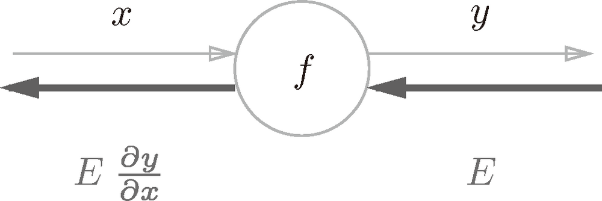
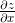
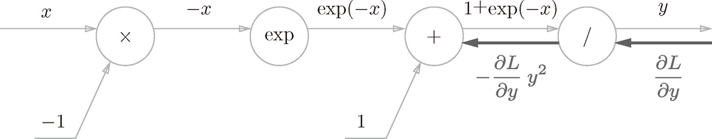
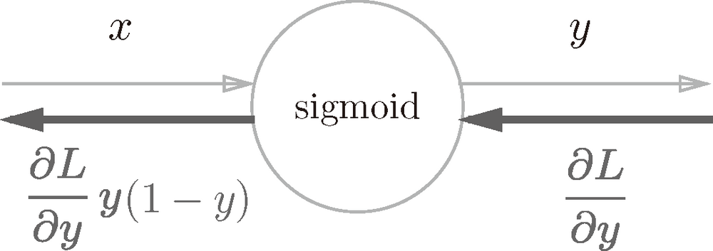
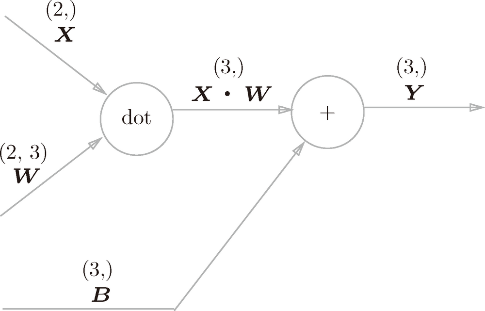

第5章 反向传播算法

### 5.1　计算图

计算图将计算过程用图形表示出来。这里说的图形是数据结构图，通过多个节点和边表示（连接节点的直线称为“边”）。为了让大家熟悉计算图，本节先用计算图解一些简单的问题。从这些简单的问题开始，逐步深入，最终抵达误差反向传播法。

#### 5.1.1　用计算图求解

现在，我们尝试用计算图解简单的问题。下面我们要看的几个问题都是用心算就能解开的简单问题，这里的目的只是通过它们让大家熟悉计算图。掌握了计算图的使用方法之后，在后面即将看到的复杂计算中它将发挥巨大威力，所以本节请一定学会计算图的使用方法。

**问题 1**：太郎在超市买了 2 个 100 日元一个的苹果，消费税是 10%，请计算支付金额。

计算图通过节点和箭头表示计算过程。节点用○表示，○中是计算的内容。将计算的中间结果写在箭头的上方，表示各个节点的计算结果从左向右传递。用计算图解问题 1，求解过程如图 5-1 所示。


**图 5-1　基于计算图求解的问题 1 的答案**

如图 5-1 所示，开始时，苹果的 100 日元流到“× 2”节点，变成 200 日元，然后被传递给下一个节点。接着，这个 200 日元流向“× 1.1”节点，变成 220 日元。因此，从这个计算图的结果可知，答案为 220 日元。

虽然图 5-1 中把“× 2”“× 1.1”等作为一个运算整体用○括起来了，不过只用○表示乘法运算“×”也是可行的。此时，如图 5-2 所示，可以将“2”和“1.1”分别作为变量“苹果的个数”和“消费税”标在○外面。


**图 5-2　基于计算图求解的问题 1 的答案：“苹果的个数”和“消费税”作为变量标在○外面**

再看下一题。

**问题 2**：太郎在超市买了 2 个苹果、3 个橘子。其中，苹果每个 100 日元，橘子每个 150 日元。消费税是 10%，请计算支付金额。

同问题 1，我们用计算图来解问题 2，求解过程如图 5-3 所示。


**图 5-3　基于计算图求解的问题 2 的答案**

这个问题中新增了加法节点“+”，用来合计苹果和橘子的金额。构建了计算图后，从左向右进行计算。就像电路中的电流流动一样，计算结果从左向右传递。到达最右边的计算结果后，计算过程就结束了。从图 5-3 中可知，问题 2 的答案为 715 日元。

综上，用计算图解题的情况下，需要按如下流程进行。

> 1. 构建计算图。
> 2. 在计算图上，从左向右进行计算。

这里的第 2 歩“从左向右进行计算”是一种正方向上的传播，简称为**正向传播**（forward propagation）。正向传播是从计算图出发点到结束点的传播。既然有正向传播这个名称，当然也可以考虑反向（从图上看的话，就是从右向左）的传播。实际上，这种传播称为**反向传播**（backward propagation）。反向传播将在接下来的导数计算中发挥重要作用。

#### 5.1.2　局部计算

计算图的特征是可以通过传递“局部计算”获得最终结果。“局部”这个词的意思是“与自己相关的某个小范围”。局部计算是指，无论全局发生了什么，都能只根据与自己相关的信息输出接下来的结果。

我们用一个具体的例子来说明局部计算。比如，在超市买了 2 个苹果和其他很多东西。此时，可以画出如图 5-4 所示的计算图。


**图 5-4　买了 2 个苹果和其他很多东西的例子**

如图 5-4 所示，假设（经过复杂的计算）购买的其他很多东西总共花费 4000 日元。这里的重点是，各个节点处的计算都是局部计算。这意味着，例如苹果和其他很多东西的求和运算（4000 + 200 → 4200）并不关心 4000 这个数字是如何计算而来的，只要把两个数字相加就可以了。换言之，各个节点处只需进行与自己有关的计算（在这个例子中是对输入的两个数字进行加法运算），不用考虑全局。

综上，计算图可以集中精力于局部计算。无论全局的计算有多么复杂，各个步骤所要做的就是对象节点的局部计算。虽然局部计算非常简单，但是通过传递它的计算结果，可以获得全局的复杂计算的结果。

#### 5.1.3　为何用计算图解题

前面我们用计算图解答了两个问题，那么计算图到底有什么优点呢？一个优点就在于前面所说的局部计算。无论全局是多么复杂的计算，都可以通过局部计算使各个节点致力于简单的计算，从而简化问题。另一个优点是，利用计算图可以将中间的计算结果全部保存起来（比如，计算进行到 2 个苹果时的金额是 200 日元、加上消费税之前的金额 650 日元等）。但是只有这些理由可能还无法令人信服。实际上，使用计算图最大的原因是，可以通过反向传播高效计算导数。

在介绍计算图的反向传播时，我们再来思考一下问题 1。问题 1 中，我们计算了购买 2 个苹果时加上消费税最终需要支付的金额。这里，假设我们想知道苹果价格的上涨会在多大程度上影响最终的支付金额，即求“支付金额关于苹果的价格的导数”。设苹果的价格为 *x*，支付金额为 *L*，则相当于求 。这个导数的值表示当苹果的价格稍微上涨时，支付金额会增加多少。

如前所述，“支付金额关于苹果的价格的导数”的值可以通过计算图的反向传播求出来。先来看一下结果，如图 5-5 所示，可以通过计算图的反向传播求导数（关于如何进行反向传播，接下来马上会介绍）。


**图 5-5　基于反向传播的导数的传递**

如图 5-5 所示，反向传播使用与正方向相反的箭头（粗线）表示。反向传播传递“局部导数”，将导数的值写在箭头的下方。在这个例子中，反向传播从右向左传递导数的值（1 → 1.1 → 2.2）。从这个结果中可知，“支付金额关于苹果的价格的导数”的值是 2.2。这意味着，如果苹果的价格上涨 1 日元，最终的支付金额会增加 2.2 日元（严格地讲，如果苹果的价格增加某个微小值，则最终的支付金额将增加那个微小值的 2.2 倍）。

这里只求了关于苹果的价格的导数，不过“支付金额关于消费税的导数”“支付金额关于苹果的个数的导数”等也都可以用同样的方式算出来。并且，计算中途求得的导数的结果（中间传递的导数）可以被共享，从而可以高效地计算多个导数。综上，计算图的优点是，可以通过正向传播和反向传播高效地计算各个变量的导数值。

### 5.2　链式法则

前面介绍的计算图的正向传播将计算结果正向（从左到右）传递，其计算过程是我们日常接触的计算过程，所以感觉上可能比较自然。而反向传播将局部导数向正方向的反方向（从右到左）传递，一开始可能会让人感到困惑。传递这个局部导数的原理，是基于**链式法则**（chain rule）的。本节将介绍链式法则，并阐明它是如何对应计算图上的反向传播的。

#### 5.2.1　计算图的反向传播

话不多说，让我们先来看一个使用计算图的反向传播的例子。假设存在 *y* = *f* (*x*) 的计算，这个计算的反向传播如图 5-6 所示。



**图 5-6　计算图的反向传播：沿着与正方向相反的方向，乘上局部导数**

如图所示，反向传播的计算顺序是，将信号 *E* 乘以节点的局部导数 ，然后将结果传递给下一个节点。这里所说的局部导数是指正向传播中 *y*= *f*(*x*) 的导数，也就是 *y* 关于 *x* 的导数 。比如，假设 *y*=*f*(*x*)=*x*2，则局部导数为 。把这个局部导数乘以上游传过来的值（本例中为 *E*），然后传递给前面的节点。

这就是反向传播的计算顺序。通过这样的计算，可以高效地求出导数的值，这是反向传播的要点。那么这是如何实现的呢？我们可以从链式法则的原理进行解释。下面我们就来介绍链式法则。

#### 5.2.2　什么是链式法则

介绍链式法则时，我们需要先从**复合函数**说起。复合函数是由多个函数构成的函数。比如，*z*=(*x*+*y*)2是由式（5.1）所示的两个式子构成的。


链式法则是关于复合函数的导数的性质，定义如下。

> 如果某个函数由复合函数表示，则该复合函数的导数可以用构成复合函数的各个函数的导数的乘积表示。

这就是链式法则的原理，乍一看可能比较难理解，但实际上它是一个非常简单的性质。以式（5.1）为例，（*z* 关于 *x* 的导数）可以用 （*z* 关于 *t* 的导数）和 （*t* 关于 *x* 的导数）的乘积表示。用数学式表示的话，可以写成式（5.2）。


式（5.2）中的  正好可以像下面这样“互相抵消”，所以记起来很简单。


现在我们使用链式法则，试着求式（5.2）的导数 。为此，我们要先求式（5.1）中的局部导数（偏导数）。


如式（5.3）所示， 等于 2*t*， 等于 1。这是基于导数公式的解析解。然后，最后要计算的  可由式（5.3）求得的导数的乘积计算出来。


#### 5.2.3　链式法则和计算图

现在我们尝试将式（5.4）的链式法则的计算用计算图表示出来。如果用“`**2`”节点表示平方运算的话，则计算图如图 5-7 所示。


**图 5-7　式（5.4）的计算图：沿着与正方向相反的方向，乘上局部导数后传递**

如图所示，计算图的反向传播从右到左传播信号。反向传播的计算顺序是，先将节点的输入信号乘以节点的局部导数（偏导数），然后再传递给下一个节点。比如，反向传播时，“`**2`”节点的输入是 ，将其乘以局部导数 （因为正向传播时输入是 *t*、输出是 *z*，所以这个节点的局部导数是 ），然后传递给下一个节点。另外，图 5-7 中反向传播最开始的信号  在前面的数学式中没有出现，这是因为 ，所以在刚才的式子中被省略了。

图 5-7 中需要注意的是最左边的反向传播的结果。根据链式法则， 成立，对应“*z* 关于 *x* 的导数”。也就是说，反向传播是基于链式法则的。

把式（5.3）的结果代入到图 5-7 中，结果如图 5-8 所示， 的结果为 2(*x* + *y*)。


**图 5-8　根据计算图的反向传播的结果， 等于 2(x + y)**

### 5.3　反向传播

上一节介绍了计算图的反向传播是基于链式法则成立的。本节将以“+”和“×”等运算为例，介绍反向传播的结构。

#### 5.3.1　加法节点的反向传播

首先来考虑加法节点的反向传播。这里以 *z* = *x* + *y* 为对象，观察它的反向传播。*z* = *x* + *y* 的导数可由下式（解析性地）计算出来。


如式（5.5）所示， 和  同时都等于 1。因此，用计算图表示的话，如图 5-9 所示。

在图 5-9 中，反向传播将从上游传过来的导数（本例中是 ）乘以 1，然后传向下游。也就是说，因为加法节点的反向传播只乘以 1，所以输入的值会原封不动地流向下一个节点。


**图 5-9　加法节点的反向传播：左图是正向传播，右图是反向传播。如右图的反向传播所示，加法节点的反向传播将上游的值原封不动地输出到下游**

另外，本例中把从上游传过来的导数的值设为 。这是因为，如图 5-10 所示，我们假定了一个最终输出值为 *L* 的大型计算图。*z* = *x* + *y* 的计算位于这个大型计算图的某个地方，从上游会传来  的值，并向下游传递  和 。


**图 5-10　加法节点存在于某个最后输出的计算的一部分中。反向传播时，从最右边的输出出发，局部导数从节点向节点反方向传播**

现在来看一个加法的反向传播的具体例子。假设有“10 + 5=15”这一计算，反向传播时，从上游会传来值 1.3。用计算图表示的话，如图 5-11 所示。


**图 5-11　加法节点的反向传播的具体例子**

因为加法节点的反向传播只是将输入信号输出到下一个节点，所以如图 5-11 所示，反向传播将 1.3 向下一个节点传递。

#### 5.3.2　乘法节点的反向传播

接下来，我们看一下乘法节点的反向传播。这里我们考虑 *z* = *xy*。这个式子的导数用式（5.6）表示。


根据式（5.6），可以像图 5-12 那样画计算图。


**图 5-12　乘法的反向传播：左图是正向传播，右图是反向传播**

乘法的反向传播会将上游的值乘以正向传播时的输入信号的“翻转值”后传递给下游。翻转值表示一种翻转关系，如图 5-12 所示，正向传播时信号是 *x* 的话，反向传播时则是 *y*；正向传播时信号是 *y* 的话，反向传播时则是 *x*。

现在我们来看一个具体的例子。比如，假设有“10 × 5 = 50”这一计算，反向传播时，从上游会传来值 1.3。用计算图表示的话，如图 5-13 所示。


**图 5-13　乘法节点的反向传播的具体例子**

因为乘法的反向传播会乘以输入信号的翻转值，所以各自可按 1.3 × 5 = 6.5、1.3 × 10 = 13 计算。另外，加法的反向传播只是将上游的值传给下游，并不需要正向传播的输入信号。但是，乘法的反向传播需要正向传播时的输入信号值。因此，实现乘法节点的反向传播时，要保存正向传播的输入信号。

#### 5.3.3　苹果的例子

再来思考一下本章最开始举的购买苹果的例子（2 个苹果和消费税）。这里要解的问题是苹果的价格、苹果的个数、消费税这 3 个变量各自如何影响最终支付的金额。这个问题相当于求“支付金额关于苹果的价格的导数”“支付金额关于苹果的个数的导数”“支付金额关于消费税的导数”。用计算图的反向传播来解的话，求解过程如图 5-14 所示。


**图 5-14　购买苹果的反向传播的例子**

如前所述，乘法节点的反向传播会将输入信号翻转后传给下游。从图 5-14 的结果可知，苹果的价格的导数是 2.2，苹果的个数的导数是 110，消费税的导数是 200。这可以解释为，如果消费税和苹果的价格增加相同的值，则消费税将对最终价格产生 200 倍大小的影响，苹果的价格将产生 2.2 倍大小的影响。不过，因为这个例子中消费税和苹果的价格的量纲不同，所以才形成了这样的结果（消费税的 1 是 100%，苹果的价格的 1 是 1 日元）。

最后作为练习，请大家来试着解一下“购买苹果和橘子”的反向传播。在图 5-15 中的方块中填入数字，求各个变量的导数（答案在若干页后）。


**图 5-15　购买苹果和橘子的反向传播的例子：在方块中填入数字，完成反向传播**

### 5.4　简单层的实现

本节将用 Python 实现前面的购买苹果的例子。这里，我们把要实现的计算图的乘法节点称为“乘法层”（`MulLayer`），加法节点称为“加法层”（`AddLayer`）。

#### 5.4.1　乘法层的实现

层的实现中有两个共通的方法（接口）`forward()` 和 `backward()`。`forward()` 对应正向传播，`backward()` 对应反向传播。

现在来实现乘法层。乘法层作为 `MulLayer` 类，其实现过程如下所示（源代码在 `ch05/layer_naive.py` 中）。

```
class MulLayer:
    def __init__(self):
        self.x = None
        self.y = None

    def forward(self, x, y):
        self.x = x
        self.y = y
        out = x * y

        return out

    def backward(self, dout):
        dx = dout * self.y # 翻转x和y
        dy = dout * self.x

        return dx, dy
```

`__init__()` 中会初始化实例变量 `x` 和 `y`，它们用于保存正向传播时的输入值。`forward()` 接收 `x` 和 `y` 两个参数，将它们相乘后输出。`backward()` 将从上游传来的导数（`dout`）乘以正向传播的翻转值，然后传给下游。

上面就是 `MulLayer` 的实现。现在我们使用 `MulLayer` 实现前面的购买苹果的例子（2 个苹果和消费税）。上一节中我们使用计算图的正向传播和反向传播，像图 5-16 这样进行了计算。


**图 5-16　购买 2 个苹果**

使用这个乘法层的话，图 5-16 的正向传播可以像下面这样实现（源代码在 `ch05/buy_apple.py`中）。

```
apple = 100
apple_num = 2
tax = 1.1

# layer
mul_apple_layer = MulLayer()
mul_tax_layer = MulLayer()

# forward
apple_price = mul_apple_layer.forward(apple, apple_num)
price = mul_tax_layer.forward(apple_price, tax)

print(price) # 220
```

此外，关于各个变量的导数可由 `backward()` 求出。

```
# backward
dprice = 1
dapple_price, dtax = mul_tax_layer.backward(dprice)
dapple, dapple_num = mul_apple_layer.backward(dapple_price)

print(dapple, dapple_num, dtax) # 2.2 110 200
```

这里，调用 `backward()` 的顺序与调用 `forward()` 的顺序相反。此外，要注意 `backward()` 的参数中需要输入“关于正向传播时的输出变量的导数”。比如，`mul_apple_layer` 乘法层在正向传播时会输出 `apple_price`，在反向传播时，则会将 `apple_price` 的导数 `dapple_price` 设为参数。另外，这个程序的运行结果和图 5-16 是一致的。

#### 5.4.2　加法层的实现

接下来，我们实现加法节点的加法层，如下所示。

```
class AddLayer:
    def __init__(self):
        pass

    def forward(self, x, y):
        out = x + y
        return out

    def backward(self, dout):
        dx = dout * 1
        dy = dout * 1
        return dx, dy
```

加法层不需要特意进行初始化，所以 `__init__()` 中什么也不运行（`pass` 语句表示“什么也不运行”）。加法层的 `forward()` 接收 `x` 和 `y` 两个参数，将它们相加后输出。`backward()` 将上游传来的导数（`dout`）原封不动地传递给下游。

现在，我们使用加法层和乘法层，实现图 5-17 所示的购买 2 个苹果和 3 个橘子的例子。


**图 5-17　购买 2 个苹果和 3 个橘子**

用 Python 实现图 5-17 的计算图的过程如下所示（源代码在 `ch05/buy_apple_orange.py` 中）。

```
apple = 100
apple_num = 2
orange = 150
orange_num = 3
tax = 1.1

# layer
mul_apple_layer = MulLayer()
mul_orange_layer = MulLayer()
add_apple_orange_layer = AddLayer()
mul_tax_layer = MulLayer()

# forward
apple_price = mul_apple_layer.forward(apple, apple_num) #(1)
orange_price = mul_orange_layer.forward(orange, orange_num) #(2)
all_price = add_apple_orange_layer.forward(apple_price, orange_price) #(3)
price = mul_tax_layer.forward(all_price, tax) #(4)

# backward
dprice = 1
dall_price, dtax = mul_tax_layer.backward(dprice) #(4)
dapple_price, dorange_price = add_apple_orange_layer.backward(dall_price) #(3)
dorange, dorange_num = mul_orange_layer.backward(dorange_price) #(2)
dapple, dapple_num = mul_apple_layer.backward(dapple_price) #(1)

print(price) # 715
print(dapple_num, dapple, dorange, dorange_num, dtax) # 110 2.2 3.3 165 650
```

这个实现稍微有一点长，但是每一条命令都很简单。首先，生成必要的层，以合适的顺序调用正向传播的 `forward()` 方法。然后，用与正向传播相反的顺序调用反向传播的 `backward()` 方法，就可以求出想要的导数。

综上，计算图中层的实现（这里是加法层和乘法层）非常简单，使用这些层可以进行复杂的导数计算。下面，我们来实现神经网络中使用的层。

### 5.5　激活函数层的实现

现在，我们将计算图的思路应用到神经网络中。这里，我们把构成神经网络的层实现为一个类。先来实现激活函数的 `ReLU` 层和 `Sigmoid` 层。

#### 5.5.1　ReLU 层

激活函数 ReLU（Rectified Linear Unit）由下式（5.7）表示。


通过式（5.7），可以求出 *y* 关于 *x* 的导数，如式（5.8）所示。


在式（5.8）中，如果正向传播时的输入 *x* 大于 0，则反向传播会将上游的值原封不动地传给下游。反过来，如果正向传播时的 *x* 小于等于 0，则反向传播中传给下游的信号将停在此处。用计算图表示的话，如图 5-18 所示。

现在我们来实现 `ReLU` 层。在神经网络的层的实现中，一般假定 `forward()` 和 `backward()` 的参数是 `NumPy` 数组。另外，实现 `ReLU` 层的源代码在 `common/layers.py` 中。


**图 5-18　ReLU 层的计算图**

```
class Relu:
    def __init__(self):
        self.mask = None

    def forward(self, x):
        self.mask = (x <= 0)
        out = x.copy()
        out[self.mask] = 0

        return out

    def backward(self, dout):
        dout[self.mask] = 0
        dx = dout

        return dx
```

`Relu` 类有实例变量 `mask`。这个变量 `mask` 是由 `True/False` 构成的 NumPy 数组，它会把正向传播时的输入 `x` 的元素中小于等于 0 的地方保存为 `True`，其他地方（大于 0 的元素）保存为 `False`。如下例所示，`mask` 变量保存了由 `True/False` 构成的 NumPy 数组。

```
>>> x = np.array( [[1.0, -0.5], [-2.0, 3.0]] )
>>> print(x)
[[ 1.  -0.5]
 [-2.   3. ]]
>>> mask = (x <= 0)
>>> print(mask)
[[False  True]
 [ True False]]
```

如图 5-18 所示，如果正向传播时的输入值小于等于 0，则反向传播的值为 0。因此，反向传播中会使用正向传播时保存的 `mask`，将从上游传来的 `dout` 的 `mask` 中的元素为 `True` 的地方设为 0。

#### 5.5.2　Sigmoid 层

接下来，我们来实现 sigmoid 函数。sigmoid 函数由式（5.9）表示。


用计算图表示式（5.9）的话，则如图 5-19 所示。


**图 5-19　sigmoid 层的计算图（仅正向传播）**

图 5-19 中，除了“×”和“+”节点外，还出现了新的“exp”和“/”节点。“exp”节点会进行 *y* = exp(*x*) 的计算，“/”节点会进行  的计算。

如图 5-19 所示，式（5.9）的计算由局部计算的传播构成。下面我们就来进行图 5-19 的计算图的反向传播。这里，作为总结，我们来依次看一下反向传播的流程。

**步骤 1**

“/”节点表示 ，它的导数可以解析性地表示为下式。


根据式（5.10），反向传播时，会将上游的值乘以 （正向传播的输出的平方乘以 -1 后的值）后，再传给下游。计算图如下所示。



**步骤 2**

“+”节点将上游的值原封不动地传给下游。计算图如下所示。


**步骤 3**

“exp”节点表示 *y* = exp(*x*)，它的导数由下式表示。


计算图中，上游的值乘以正向传播时的输出（这个例子中是 exp(-*x*)）后，再传给下游。


**步骤 4**

“×”节点将正向传播时的值翻转后做乘法运算。因此，这里要乘以 -1。


**图 5-20　Sigmoid 层的计算图**

根据上述内容，图 5-20 的计算图可以进行 Sigmoid 层的反向传播。从图 5-20 的结果可知，反向传播的输出为 ，这个值会传播给下游的节点。这里要注意， 这个值只根据正向传播时的输入 *x* 和输出 *y* 就可以算出来。因此，图 5-20 的计算图可以画成图 5-21 的集约化的“sigmoid”节点。


**图 5-21　Sigmoid 层的计算图（简洁版）**

图 5-20 的计算图和简洁版的图 5-21 的计算图的计算结果是相同的，但是，简洁版的计算图可以省略反向传播中的计算过程，因此计算效率更高。此外，通过对节点进行集约化，可以不用在意 Sigmoid 层中琐碎的细节，而只需要专注它的输入和输出，这一点也很重要。

另外， 可以进一步整理如下。


因此，图 5-21 所表示的 Sigmoid 层的反向传播，只根据正向传播的输出就能计算出来。



**图 5-22　Sigmoid 层的计算图：可以根据正向传播的输出 y 计算反向传播**

现在，我们用 Python 实现 Sigmoid 层。参考图 5-22，可以像下面这样实现（实现的代码在 `common/layers.py` 中）。

```
class Sigmoid:
    def __init__(self):
        self.out = None

    def forward(self, x):
        out = 1 / (1 + np.exp(-x))
        self.out = out

        return out

    def backward(self, dout):
        dx = dout * (1.0 - self.out) * self.out

        return dx
```

这个实现中，正向传播时将输出保存在了实例变量 `out` 中。然后，反向传播时，使用该变量 `out` 进行计算。

### 5.6　Affine/Softmax 层的实现

#### 5.6.1　Affine 层

神经网络的正向传播中，为了计算加权信号的总和，使用了矩阵的乘积运算（NumPy 中是 `np.dot()`，具体请参照 3.3 节）。比如，还记得我们用 Python 进行了下面的实现吗？

```
>>> X = np.random.rand(2)   # 输入
>>> W = np.random.rand(2,3) # 权重
>>> B = np.random.rand(3)   # 偏置
>>>
>>> X.shape # (2,)
>>> W.shape # (2, 3)
>>> B.shape # (3,)
>>>
>>> Y = np.dot(X, W) + B
```

这里，**X**、**W、B** 分别是形状为 (2,)、(2, 3)、(3,) 的多维数组。这样一来，神经元的加权和可以用 `Y = np.dot(X, W) + B` 计算出来。然后，**Y** 经过激活函数转换后，传递给下一层。这就是神经网络正向传播的流程。此外，我们来复习一下，矩阵的乘积运算的要点是使对应维度的元素个数一致。比如，如下面的图 5-23 所示，**X** 和 **W** 的乘积必须使对应维度的元素个数一致。另外，这里矩阵的形状用 (2, 3) 这样的括号表示（为了和 NumPy 的 `shape` 属性的输出一致）。


**图 5-23　矩阵的乘积运算中对应维度的元素个数要保持一致**

现在将这里进行的求矩阵的乘积与偏置的和的运算用计算图表示出来。将乘积运算用“dot”节点表示的话，则 `np.dot(X, W) + B` 的运算可用图 5-24 所示的计算图表示出来。另外，在各个变量的上方标记了它们的形状（比如，计算图上显示了 **X** 的形状为 (2,)，**X** · **W** 的形状为 (3,) 等）。



**图 5-24　Affine 层的计算图（注意变量是矩阵，各个变量的上方标记了该变量的形状）**

图 5-24 是比较简单的计算图，不过要注意 **X**、**W**、**B** 是矩阵（多维数组）。之前我们见到的计算图中各个节点间流动的是标量，而这个例子中各个节点间传播的是矩阵。

现在我们来考虑图 5-24 的计算图的反向传播。以矩阵为对象的反向传播，按矩阵的各个元素进行计算时，步骤和以标量为对象的计算图相同。实际写一下的话，可以得到下式（这里省略了式（5.13）的推导过程）。


式（5.13）中 **W**T 的 T 表示转置。转置操作会把 **W** 的元素 (*i*, *j*) 换成元素 (*j*, *i*)。用数学式表示的话，可以写成下面这样。


如式（5.14）所示，如果 **W** 的形状是 (2, 3)，**W**T 的形状就是 (3, 2)。

现在，我们根据式（5.13），尝试写出计算图的反向传播，如图 5-25 所示。


**图 5-25　Affine 层的反向传播：注意变量是多维数组。反向传播时各个变量的下方标记了该变量的形状**

我们看一下图 2-25 的计算图中各个变量的形状。尤其要注意，**X** 和  形状相同，**W** 和  形状相同。从下面的数学式可以很明确地看出 **X** 和  形状相同。


为什么要注意矩阵的形状呢？因为矩阵的乘积运算要求对应维度的元素个数保持一致，通过确认一致性，就可以导出式（5.13）。比如， 的形状是 (3,)，**W** 的形状是 (2, 3) 时，思考  和 **W**T 的乘积，使得  的形状为 (2,)（图 5-26）。这样一来，就会自然而然地推导出式（5.13）。


**图 5-26　矩阵的乘积（“dot”节点）的反向传播可以通过组建使矩阵对应维度的元素个数一致的乘积运算而推导出来**

#### 5.6.2　批版本的 Affine 层

前面介绍的 Affine层的输入 **X** 是以单个数据为对象的。现在我们考虑 *N* 个数据一起进行正向传播的情况，也就是批版本的 Affine层。

先给出批版本的 Affine层的计算图，如图 5-27 所示。


**图 5-27　批版本的 Affine 层的计算图**

与刚刚不同的是，现在输入 **X** 的形状是 (*N*, 2)。之后就和前面一样，在计算图上进行单纯的矩阵计算。反向传播时，如果注意矩阵的形状，就可以和前面一样推导出  和 。

加上偏置时，需要特别注意。正向传播时，偏置被加到 **X** · **W** 的各个数据上。比如，*N* = 2（数据为 2 个）时，偏置会被分别加到这 2 个数据（各自的计算结果）上，具体的例子如下所示。

```
>>> X_dot_W = np.array([[0, 0, 0], [10, 10, 10]])
>>> B = np.array([1, 2, 3])
>>>
>>> X_dot_W
array([[ 0,  0,  0],
       [ 10, 10, 10]])
>>> X_dot_W + B
array([[ 1,  2,  3],
       [11, 12, 13]])
```

正向传播时，偏置会被加到每一个数据（第 1 个、第 2 个……）上。因此，反向传播时，各个数据的反向传播的值需要汇总为偏置的元素。用代码表示的话，如下所示。

```
>>> dY = np.array([[1, 2, 3,], [4, 5, 6]])
>>> dY
array([[1, 2, 3],
       [4, 5, 6]])
>>>
>>> dB = np.sum(dY, axis=0)
>>> dB
array([5, 7, 9])
```

这个例子中，假定数据有 2 个（*N* = 2）。偏置的反向传播会对这 2 个数据的导数按元素进行求和。因此，这里使用了 `np.sum()` 对第 0 轴（以数据为单位的轴，`axis=0`）方向上的元素进行求和。

综上所述，Affine 的实现如下所示。另外，`common/layers.py` 中的 Affine 的实现考虑了输入数据为张量（四维数据）的情况，与这里介绍的稍有差别。

```
class Affine:
    def __init__(self, W, b):
        self.W = W
        self.b = b
        self.x = None
        self.dW = None
        self.db = None

    def forward(self, x):
        self.x = x
        out = np.dot(x, self.W) + self.b

        return out

    def backward(self, dout):
        dx = np.dot(dout, self.W.T)
        self.dW = np.dot(self.x.T, dout)
        self.db = np.sum(dout, axis=0)

        return dx
```

#### 5.6.3　Softmax-with-Loss 层

最后介绍一下输出层的 softmax 函数。前面我们提到过，softmax 函数会将输入值正规化之后再输出。比如手写数字识别时，Softmax 层的输出如图 5-28 所示。


**图 5-28　输入图像通过 Affine 层和 ReLU 层进行转换，10 个输入通过 Softmax 层进行正规化。在这个例子中，“0”的得分是 5.3，这个值经过 Softmax 层转换为 0.008（0.8%）；“2”的得分是 10.1，被转换为 0.991（99.1%）**

在图 5-28 中，Softmax 层将输入值正规化（将输出值的和调整为 1）之后再输出。另外，因为手写数字识别要进行 10 类分类，所以向Softmax 层的输入也有 10 个。

下面来实现 Softmax 层。考虑到这里也包含作为损失函数的交叉熵误差（cross entropy error），所以称为“Softmax-with-Loss 层”。Softmax-with-Loss 层（Softmax 函数和交叉熵误差）的计算图如图 5-29 所示。


**图 5-29　Softmax-with-Loss 层的计算图**

可以看到，Softmax-with-Loss 层有些复杂。这里只给出了最终结果，对 Softmax-with-Loss 层的导出过程感兴趣的读者，请参照附录 A。

图 5-29 的计算图可以简化成图 5-30。

图 5-30 的计算图中，softmax 函数记为 Softmax 层，交叉熵误差记为 Cross Entropy Error 层。这里假设要进行 3 类分类，从前面的层接收 3 个输入（得分）。如图 5-30 所示，Softmax 层将输入(*a*1, *a*2, *a*3) 正规化，输出(*y*1, *y*2, *y*3)。Cross Entropy Error 层接收 Softmax 的输出(*y*1, *y*2, *y*3) 和教师标签(*t*1, *t*2, *t*3)，从这些数据中输出损失 *L*。


**图 5-30　“简易版”的 Softmax-with-Loss 层的计算图**

图 5-30 中要注意的是反向传播的结果。Softmax 层的反向传播得到了(*y*1-*t*1, *y*2-*t*2, *y*3-*t*3)这样“漂亮”的结果。由于(*y*1, *y*2, *y*3)是 Softmax 层的输出，(*t*1, *t*2, *t*3)是监督数据，所以(*y*1-*t*1, *y*2-*t*2, *y*3-*t*3)是 Softmax 层的输出和教师标签的差分。神经网络的反向传播会把这个差分表示的误差传递给前面的层，这是神经网络学习中的重要性质。

神经网络学习的目的就是通过调整权重参数，使神经网络的输出（Softmax 的输出）接近教师标签。因此，必须将神经网络的输出与教师标签的误差高效地传递给前面的层。刚刚的(*y*1-*t*1, *y*2-*t*2, *y*3-*t*3)正是 Softmax 层的输出与教师标签的差，直截了当地表示了当前神经网络的输出与教师标签的误差。

这里考虑一个具体的例子，比如思考教师标签是（0, 1, 0），Softmax 层的输出是 (0.3, 0.2, 0.5) 的情形。因为正确解标签处的概率是 0.2（20%），这个时候的神经网络未能进行正确的识别。此时，Softmax 层的反向传播传递的是 (0.3, -0.8, 0.5) 这样一个大的误差。因为这个大的误差会向前面的层传播，所以 Softmax 层前面的层会从这个大的误差中学习到“大”的内容。

再举一个例子，比如思考教师标签是 (0, 1, 0)，Softmax 层的输出是 (0.01, 0.99, 0) 的情形（这个神经网络识别得相当准确）。此时 Softmax 层的反向传播传递的是 (0.01, -0.01, 0) 这样一个小的误差。这个小的误差也会向前面的层传播，因为误差很小，所以 Softmax 层前面的层学到的内容也很“小”。

现在来进行 Softmax-with-Loss 层的实现，实现过程如下所示。

```
class SoftmaxWithLoss:
    def __init__(self):
        self.loss = None # 损失
        self.y = None    # softmax的输出
        self.t = None    # 监督数据（one-hot vector）

    def forward(self, x, t):
        self.t = t
        self.y = softmax(x)
        self.loss = cross_entropy_error(self.y, self.t)

        return self.loss

    def backward(self, dout=1):
        batch_size = self.t.shape[0]
        dx = (self.y - self.t) / batch_size

        return dx
```

这个实现利用了 3.5.2 节和 4.2.4 节中实现的 `softmax()` 和 `cross_entropy_error()` 函数。因此，这里的实现非常简单。请注意反向传播时，将要传播的值除以批的大小（`batch_size`）后，传递给前面的层的是单个数据的误差。

### 5.7　误差反向传播法的实现

通过像组装乐高积木一样组装上一节中实现的层，可以构建神经网络。本节我们将通过组装已经实现的层来构建神经网络。

#### 5.7.1　神经网络学习的全貌图

在进行具体的实现之前，我们再来确认一下神经网络学习的全貌图。神经网络学习的步骤如下所示。

> **前提**
>
> 神经网络中有合适的权重和偏置，调整权重和偏置以便拟合训练数据的过程称为学习。神经网络的学习分为下面 4 个步骤。
>
> **步骤 1（mini-batch**）
>
> 从训练数据中随机选择一部分数据。
>
> **步骤 2（计算梯度）**
>
> 计算损失函数关于各个权重参数的梯度。
>
> **步骤 3（更新参数）**
>
> 将权重参数沿梯度方向进行微小的更新。
>
> **步骤 4（重复）**
>
> 重复步骤 1、步骤 2、步骤 3。

之前介绍的误差反向传播法会在步骤 2 中出现。上一章中，我们利用数值微分求得了这个梯度。数值微分虽然实现简单，但是计算要耗费较多的时间。和需要花费较多时间的数值微分不同，误差反向传播法可以快速高效地计算梯度。

#### 5.7.2　对应误差反向传播法的神经网络的实现

现在来进行神经网络的实现。这里我们要把2层神经网络实现为`TwoLayerNet`。首先，将这个类的实例变量和方法整理成表 5-1 和表 5-2。

**表 5-1 TwoLayerNet 类的实例变量**

| 实例变量    | 说明                                                         |
| :---------- | :----------------------------------------------------------- |
| `params`    | 保存神经网络的参数的字典型变量。 `params['W1']` 是第 1 层的权重，`params['b1']` 是第 1 层的偏置。 `params['W2']` 是第 2 层的权重，`params['b2']` 是第 2 层的偏置 |
| `layers`    | 保存神经网络的层的**有序字典型变量**。 以 `layers['Affine1']`、`layers['ReLu1']`、`layers['Affine2']` 的形式，通过有序字典保存各个层 |
| `lastLayer` | 神经网络的最后一层。本例中为 `SoftmaxWithLoss` 层            |

**表 5-2 TwoLayerNet 类的方法**

| 方法                                                         | 说明                                                         |
| :----------------------------------------------------------- | :----------------------------------------------------------- |
| `__init__(self, input_size, hidden_size, output_size, weight_init_std)` | 进行初始化。 参数从头开始依次是输入层的神经元数、隐藏层的神经元数、输出层的神经元数、初始化权重时的高斯分布的规模 |
| `predict(self, x)`                                           | 进行识别（推理）。 参数 `x` 是图像数据                       |
| `loss(self, x, t)`                                           | 计算损失函数的值。 参数 `X` 是图像数据、`t` 是正确解标签     |
| `accuracy(self, x, t)`                                       | 计算识别精度                                                 |
| `numerical_gradient(self, x, t)`                             | 通过数值微分计算关于权重参数的梯度（同上一章）               |
| `gradient(self, x, t)`                                       | 通过误差反向传播法计算关于权重参数的梯度                     |

这个类的实现稍微有一点长，但是内容和 4.5 节的学习算法的实现有很多共通的部分，不同点主要在于这里使用了层。通过使用层，获得识别结果的处理（`predict()`）和计算梯度的处理（`gradient()`）只需通过层之间的传递就能完成。下面是 `TwoLayerNet` 的代码实现。

```
import sys, os
sys.path.append(os.pardir)
import numpy as np
from common.layers import *
from common.gradient import numerical_gradient
from collections import OrderedDict

class TwoLayerNet:

    def __init__(self, input_size, hidden_size, output_size,
                 weight_init_std=0.01):
        # 初始化权重
        self.params = {}
        self.params['W1'] = weight_init_std * \
                            np.random.randn(input_size, hidden_size)
        self.params['b1'] = np.zeros(hidden_size)
        self.params['W2'] = weight_init_std * \
                            np.random.randn(hidden_size, output_size)
        self.params['b2'] = np.zeros(output_size)

        # 生成层
        self.layers = OrderedDict()
        self.layers['Affine1'] = \
            Affine(self.params['W1'], self.params['b1'])
        self.layers['Relu1'] = Relu()
        self.layers['Affine2'] = \
            Affine(self.params['W2'], self.params['b2'])

        self.lastLayer = SoftmaxWithLoss()

    def predict(self, x):
        for layer in self.layers.values():
            x = layer.forward(x)

        return x

    # x:输入数据, t:监督数据
    def loss(self, x, t):
        y = self.predict(x)
        return self.lastLayer.forward(y, t)

    def accuracy(self, x, t):
        y = self.predict(x)
        y = np.argmax(y, axis=1)
        if t.ndim != 1 : t = np.argmax(t, axis=1)
        accuracy = np.sum(y == t) / float(x.shape[0])
        return accuracy

    # x:输入数据, t:监督数据
    def numerical_gradient(self, x, t):
        loss_W = lambda W: self.loss(x, t)

        grads = {}
        grads['W1'] = numerical_gradient(loss_W, self.params['W1'])
        grads['b1'] = numerical_gradient(loss_W, self.params['b1'])
        grads['W2'] = numerical_gradient(loss_W, self.params['W2'])
        grads['b2'] = numerical_gradient(loss_W, self.params['b2'])

        return grads

    def gradient(self, x, t):
        # forward
        self.loss(x, t)

        # backward
        dout = 1
        dout = self.lastLayer.backward(dout)

        layers = list(self.layers.values())
        layers.reverse()
        for layer in layers:
            dout = layer.backward(dout)

        # 设定
        grads = {}
        grads['W1'] = self.layers['Affine1'].dW
        grads['b1'] = self.layers['Affine1'].db
        grads['W2'] = self.layers['Affine2'].dW
        grads['b2'] = self.layers['Affine2'].db

        return grads
```

请注意这个实现中的粗体字代码部分，尤其是将神经网络的层保存为 `OrderedDict` 这一点非常重要。`OrderedDict` 是有序字典，“有序”是指它可以记住向字典里添加元素的顺序。因此，神经网络的正向传播只需按照添加元素的顺序调用各层的 `forward()` 方法就可以完成处理，而反向传播只需要按照相反的顺序调用各层即可。因为 Affine 层和 ReLU 层的内部会正确处理正向传播和反向传播，所以这里要做的事情仅仅是以正确的顺序连接各层，再按顺序（或者逆序）调用各层。

像这样通过将神经网络的组成元素以层的方式实现，可以轻松地构建神经网络。这个用层进行模块化的实现具有很大优点。因为想另外构建一个神经网络（比如 5 层、10 层、20 层……的大的神经网络）时，只需像组装乐高积木那样添加必要的层就可以了。之后，通过各个层内部实现的正向传播和反向传播，就可以正确计算进行识别处理或学习所需的梯度。

#### 5.7.3　误差反向传播法的梯度确认

到目前为止，我们介绍了两种求梯度的方法。一种是基于数值微分的方法，另一种是解析性地求解数学式的方法。后一种方法通过使用误差反向传播法，即使存在大量的参数，也可以高效地计算梯度。因此，后文将不再使用耗费时间的数值微分，而是使用误差反向传播法求梯度。

数值微分的计算很耗费时间，而且如果有误差反向传播法的（正确的）实现的话，就没有必要使用数值微分的实现了。那么数值微分有什么用呢？实际上，在确认误差反向传播法的实现是否正确时，是需要用到数值微分的。

数值微分的优点是实现简单，因此，一般情况下不太容易出错。而误差反向传播法的实现很复杂，容易出错。所以，经常会比较数值微分的结果和误差反向传播法的结果，以确认误差反向传播法的实现是否正确。确认数值微分求出的梯度结果和误差反向传播法求出的结果是否一致（严格地讲，是非常相近）的操作称为**梯度确认**（gradient check）。梯度确认的代码实现如下所示（源代码在 `ch05/gradient_check.py` 中）。

```
import sys, os
sys.path.append(os.pardir)
import numpy as np
from dataset.mnist import load_mnist
from two_layer_net import TwoLayerNet

# 读入数据
(x_train, t_train), (x_test, t_test) = \ load_mnist(normalize=True, one_
hot_label = True)

network = TwoLayerNet(input_size=784, hidden_size=50, output_size=10)

x_batch = x_train[:3]
t_batch = t_train[:3]

grad_numerical = network.numerical_gradient(x_batch, t_batch)
grad_backprop = network.gradient(x_batch, t_batch)

# 求各个权重的绝对误差的平均值
for key in grad_numerical.keys():
    diff = np.average( np.abs(grad_backprop[key] - grad_numerical[key]) )
    print(key + ":" + str(diff))
```

和以前一样，读入 MNIST 数据集。然后，使用训练数据的一部分，确认数值微分求出的梯度和误差反向传播法求出的梯度的误差。这里误差的计算方法是求各个权重参数中对应元素的差的绝对值，并计算其平均值。运行上面的代码后，会输出如下结果。

```
b1:9.70418809871e-13
W2:8.41139039497e-13
b2:1.1945999745e-10
W1:2.2232446644e-13
```

从这个结果可以看出，通过数值微分和误差反向传播法求出的梯度的差非常小。比如，第 1 层的偏置的误差是 `9.7e-13`（`0.00000000000097`）。这样一来，我们就知道了通过误差反向传播法求出的梯度是正确的，误差反向传播法的实现没有错误。

#### 5.7.4　使用误差反向传播法的学习

最后，我们来看一下使用了误差反向传播法的神经网络的学习的实现。和之前的实现相比，不同之处仅在于通过误差反向传播法求梯度这一点。

```
import sys, os
sys.path.append(os.pardir)
import numpy as np
from dataset.mnist import load_mnist
from two_layer_net import TwoLayerNet

# 读入数据
(x_train, t_train), (x_test, t_test) = \
    load_mnist(normalize=True, one_hot_label=True)

network = TwoLayerNet(input_size=784, hidden_size=50, output_size=10)

iters_num = 10000
train_size = x_train.shape[0]
batch_size = 100
learning_rate = 0.1
train_loss_list = []
train_acc_list = []
test_acc_list = []

iter_per_epoch = max(train_size / batch_size, 1)

for i in range(iters_num):
    batch_mask = np.random.choice(train_size, batch_size)
    x_batch = x_train[batch_mask]
    t_batch = t_train[batch_mask]

    # 通过误差反向传播法求梯度
    grad = network.gradient(x_batch, t_batch)

    # 更新
    for key in ('W1', 'b1', 'W2', 'b2'):
        network.params[key] -= learning_rate * grad[key]

    loss = network.loss(x_batch, t_batch)
    train_loss_list.append(loss)

    if i % iter_per_epoch == 0:
        train_acc = network.accuracy(x_train, t_train)
        test_acc = network.accuracy(x_test, t_test)
        train_acc_list.append(train_acc)
        test_acc_list.append(test_acc)
        print(train_acc, test_acc)
```

### 